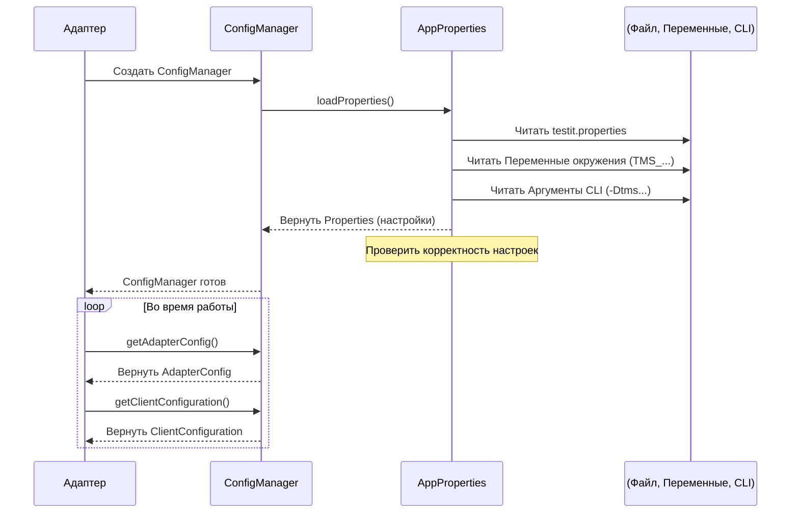

# Chapter 1: Конфигурация Адаптера


Добро пожаловать в руководство по `adapters-java`! В этой первой главе мы разберемся с одним из фундаментальных понятий: **Конфигурацией Адаптера**.

Представьте, что вы настраиваете новое приложение или игру. Вам обычно нужно указать, как оно должно работать, куда подключаться, какие функции использовать. Конфигурация Адаптера для Test IT делает то же самое — это как его панель управления или файл настроек.

## Зачем нужна конфигурация?

Адаптеру нужно знать несколько вещей, чтобы правильно работать и отправлять результаты ваших тестов в систему Test IT:

1.  **Куда подключаться?** Ему нужен адрес (URL) вашего сервера Test IT.
2.  **Кто подключается?** Нужен секретный ключ (приватный токен) для аутентификации, чтобы Test IT знал, что это именно вы отправляете результаты.
3.  **Куда отправлять результаты?** Нужно указать ID проекта и ID конфигурации в Test IT, чтобы результаты попали в нужное место.
4.  **Как работать?** Нужно определить, как адаптер будет себя вести: например, нужно ли ему автоматически создавать новые тест-кейсы в Test IT, если их там еще нет, или в каком режиме запускать тесты.

Без этих настроек адаптер просто не будет знать, что делать. Компонент "Конфигурация Адаптера" отвечает за чтение, хранение и предоставление этих настроек остальным частям адаптера.

## Источники конфигурации

Адаптер может получать настройки из нескольких мест, что делает его гибким:

1.  **Файл `testit.properties`:** Это самый распространенный способ. Вы создаете файл с именем `testit.properties` в ресурсах вашего проекта (`src/test/resources`) и прописываете в нем все нужные параметры.
2.  **Переменные окружения:** Настройки можно задать через переменные окружения системы. Это часто используется в CI/CD системах (например, Jenkins, GitLab CI, GitHub Actions), чтобы не хранить секретные токены прямо в коде. Имена переменных обычно начинаются с `TMS_`, например, `TMS_URL`, `TMS_PRIVATE_TOKEN`.
3.  **Аргументы командной строки (Системные свойства Java):** Настройки можно передать при запуске тестов через `-D` флаги. Например: `-DtmsUrl=http://localhost:8080 -DtmsPrivateToken=...`.

**Приоритет:** Адаптер ищет настройки в следующем порядке: сначала аргументы командной строки, затем переменные окружения, и в последнюю очередь — файл `testit.properties`. Это значит, что если настройка задана и в файле, и как переменная окружения, будет использовано значение из переменной окружения.

## Файл `testit.properties`

Давайте посмотрим на типичный файл `testit.properties`:

```properties
# testit.properties - Пример файла конфигурации

# Адрес вашего сервера Test IT
url=

# Ваш приватный токен (лучше использовать переменные окружения!)
privateToken=

# ID проекта в Test IT
projectId=

# ID конфигурации в Test IT
configurationId=

# ID существующего тест-рана (если не создается новый)
testRunId=

# Имя для нового тест-рана (если создается новый)
testRunName=

# Режим работы адаптера (0, 1 или 2)
adapterMode=

# Создавать ли автоматически тест-кейсы в Test IT? (true/false)
# automaticCreationTestCases=false

# Обновлять ли автоматически ссылки на автотесты в тест-кейсах? (true/false)
# automaticUpdationLinksToTestCases=false

# Включить/выключить валидацию SSL сертификата (true/false)
# certValidation=true

# Включена ли интеграция с Test IT? (true/false) - для временного отключения
# testIt=true

# Отправлять ли результаты в реальном времени? (true/false) - для некоторых режимов
# importRealtime=true
```

*   **``:** Это просто заполнители. Вам нужно заменить их на ваши реальные значения (URL, токен, ID).
*   **Строки с `#`:** Это комментарии, они игнорируются. Используйте их для пояснений.
*   Некоторые параметры (например, `automaticCreationTestCases`) закомментированы — это значит, что они необязательны и будут использовать значения по умолчанию, если их не указать.

## Как это работает внутри? Классы конфигурации

В коде `adapters-java` настройки хранятся в специальных Java-классах. Два основных класса:

1.  **`ClientConfiguration`**: Хранит настройки, необходимые для подключения к API Test IT.
2.  **`AdapterConfig`**: Хранит настройки, управляющие поведением самого адаптера.

Давайте взглянем на них упрощенно.

### `ClientConfiguration`

Этот класс содержит все данные для взаимодействия с сервером Test IT.

```java
// Упрощенный пример из ClientConfiguration.java
package ru.testit.clients;

import java.util.Properties;
// ... другие импорты

public class ClientConfiguration {
    private String privateToken; // Приватный токен
    private String projectId;    // ID проекта
    private String url;          // URL сервера Test IT
    private String configurationId; // ID конфигурации
    private String testRunId;    // ID Тест-рана
    private String testRunName;  // Имя Тест-рана

    // Конструктор, который читает настройки из Properties
    public ClientConfiguration(Properties properties) {
        this.privateToken = properties.getProperty(AppProperties.PRIVATE_TOKEN);
        this.projectId = properties.getProperty(AppProperties.PROJECT_ID);
        this.url = Utils.urlTrim(properties.getProperty(AppProperties.URL));
        // ... чтение остальных свойств ...
    }

    // Методы для получения значений (getters)
    public String getPrivateToken() { return privateToken; }
    public String getProjectId() { return projectId; }
    public String getUrl() { return url; }
    // ... остальные геттеры ...
}
```

Когда адаптеру нужно отправить данные в Test IT (например, результаты теста), он обратится к объекту `ClientConfiguration`, чтобы получить URL, токен и другие нужные параметры для [Клиента API](07_клиент_api_и_запись_результатов_.md).

### `AdapterConfig`

Этот класс содержит настройки, определяющие, как адаптер должен обрабатывать тесты.

```java
// Упрощенный пример из AdapterConfig.java
package ru.testit.properties;

import java.util.Properties;
// ... другие импорты

public class AdapterConfig {
    private AdapterMode mode; // Режим работы адаптера
    private boolean automaticCreationTestCases; // Авто-создание тест-кейсов
    private boolean tmsIntegration; // Включена ли интеграция

    // Конструктор, читающий настройки
    public AdapterConfig(Properties properties) {
        // Определяем режим работы
        try {
            String modeValue = properties.getProperty(AppProperties.ADAPTER_MODE, "0"); // По умолчанию 0
            this.mode = AdapterMode.valueOf(Integer.parseInt(modeValue));
        } catch (Exception ignored) {
            this.mode = AdapterMode.USE_FILTER; // Безопасное значение по умолчанию
        }

        // Читаем флаг авто-создания тест-кейсов
        this.automaticCreationTestCases = Boolean.parseBoolean(
            properties.getProperty(AppProperties.AUTOMATIC_CREATION_TEST_CASES, "false") // По умолчанию false
        );

        // Читаем флаг включения интеграции
        this.tmsIntegration = Boolean.parseBoolean(
             properties.getProperty(AppProperties.TMS_INTEGRATION, "true") // По умолчанию true
        );
    }

    // Методы для получения значений (getters)
    public AdapterMode getMode() { return mode; }
    public boolean shouldAutomaticCreationTestCases() { return automaticCreationTestCases; }
    public boolean shouldEnableTmsIntegration() { return tmsIntegration; }
}
```

На основе этих настроек [Менеджер Адаптера](06_менеджер_адаптера_.md) решает, какие тесты запускать, нужно ли создавать новые тест-кейсы в Test IT и т.д.

### `AdapterMode` (Режимы работы)

Параметр `adapterMode` определяет стратегию запуска тестов:

```java
// Файл: AdapterMode.java
package ru.testit.properties;

public enum AdapterMode {
    USE_FILTER(0), // Запускать только тесты, указанные в тест-ране Test IT (фильтрация)
    RUN_ALL_TESTS(1), // Запускать все найденные тесты и связывать с существующим тест-раном
    NEW_TEST_RUN(2); // Создать новый тест-ран в Test IT и запустить все найденные тесты

    // ... внутренняя реализация ...
}
```

*   **`0` (USE_FILTER):** Адаптер получает список тестов из указанного `testRunId` в Test IT и запускает только их. Тесты, не включенные в тест-ран, будут проигнорированы.
*   **`1` (RUN_ALL_TESTS):** Адаптер запускает все тесты, которые находит в проекте, и привязывает их результаты к существующему `testRunId`.
*   **`2` (NEW_TEST_RUN):** Адаптер создает новый тест-ран в Test IT (используя `testRunName` или генерируя имя), запускает все найденные тесты и отправляет результаты в этот новый тест-ран. `testRunId` в этом режиме указывать не нужно (и даже вредно).

## Загрузка и проверка: `AppProperties`

Класс `AppProperties` — это мозг процесса конфигурации. Он делает две важные вещи:

1.  **Определяет имена ключей:** Содержит константы для всех имен свойств (например, `URL`, `PRIVATE_TOKEN`).
2.  **Загружает и проверяет свойства:** Имеет логику для чтения настроек из файла, переменных окружения и аргументов командной строки, а также проверяет их на корректность.

```java
// Упрощенный пример из AppProperties.java
package ru.testit.properties;

import java.util.Properties;
// ... другие импорты

public class AppProperties {
    // Константы для имен свойств
    public static final String URL = "url";
    public static final String PRIVATE_TOKEN = "privateToken";
    // ... остальные константы ...

    // Имена переменных окружения и аргументов CLI
    private static final HashMap<String, HashMap<String, String>> envVarsNames = /* ... */;

    // Основной метод загрузки
    public static Properties loadProperties() {
        Properties properties = new Properties();
        String configFile = getConfigFileName(); // Определяем имя файла (обычно testit.properties)

        // 1. Загружаем из файла (из classpath)
        loadPropertiesFrom(Thread.currentThread().getContextClassLoader(), properties, configFile);

        // 2. Загружаем из переменных окружения и системных свойств (перезаписывают файл)
        Properties systemProps = System.getProperties();
        Properties envProps = new Properties();
        envProps.putAll(System.getenv());

        // Применяем переменные окружения и аргументы CLI (с более высоким приоритетом)
        properties.putAll(loadPropertiesFromEnv(systemProps, envVarsNames.get("env")));
        properties.putAll(loadPropertiesFromEnv(envProps, envVarsNames.get("env")));
        properties.putAll(loadPropertiesFromEnv(systemProps, envVarsNames.get("cli")));
        properties.putAll(loadPropertiesFromEnv(envProps, envVarsNames.get("cli")));


        // 3. Проверяем корректность обязательных полей
        if (shouldValidate(properties)) {
            return validateProperties(properties); // Выбрасывает ошибку, если что-то не так
        }
        return properties;
    }

    // Вспомогательные методы: loadPropertiesFrom, loadPropertiesFromEnv, validateProperties...
    // ...
}
```

Метод `loadProperties()` выполняет всю работу по сбору настроек из разных источников в один объект `Properties` и проверяет, что все обязательные поля (URL, токен, ID проекта и т.д.) заданы корректно. Если что-то не так, адаптер не сможет запуститься, и вы увидите ошибку в логах.

## `ConfigManager`: Удобный доступ к конфигурации

Чтобы не работать напрямую с `AppProperties` и объектом `Properties`, используется `ConfigManager`. Это простой класс, который инициализируется загруженными свойствами и предоставляет готовые объекты `ClientConfiguration` и `AdapterConfig`.

```java
// Файл: ConfigManager.java
package ru.testit.services;

import ru.testit.clients.ClientConfiguration;
import ru.testit.properties.AdapterConfig;
import java.util.Properties;

public class ConfigManager {
    private final Properties properties; // Хранит загруженные свойства

    public ConfigManager(Properties properties) {
        this.properties = properties;
    }

    // Возвращает конфигурацию клиента API
    public AdapterConfig getAdapterConfig() {
        return new AdapterConfig(properties);
    }

    // Возвращает конфигурацию поведения адаптера
    public ClientConfiguration getClientConfiguration() {
        return new ClientConfiguration(properties);
    }
}
```

[Менеджер Адаптера](06_менеджер_адаптера_.md) создает `ConfigManager` один раз при старте, используя `AppProperties.loadProperties()`, а затем использует `getAdapterConfig()` и `getClientConfiguration()` для получения нужных настроек.

## Общая схема работы

Вот как выглядит процесс получения конфигурации:



## Заключение

Конфигурация Адаптера — это основа основ. Она позволяет точно настроить, как адаптер будет подключаться к Test IT и взаимодействовать с вашими тестами. Вы можете гибко задавать параметры через файл `testit.properties`, переменные окружения или аргументы командной строки. Классы `ClientConfiguration` и `AdapterConfig` хранят эти настройки, а `AppProperties` и `ConfigManager` отвечают за их загрузку и предоставление остальным частям адаптера.

Теперь, когда мы знаем, как настроить адаптер, в следующей главе мы узнаем, как помечать наши тесты специальными аннотациями, чтобы адаптер мог их найти и собрать нужную информацию для Test IT.

**Следующая глава:** [Аннотации для Тестов](02_аннотации_для_тестов_.md)

---

Generated by [AI Codebase Knowledge Builder](https://github.com/The-Pocket/Tutorial-Codebase-Knowledge)