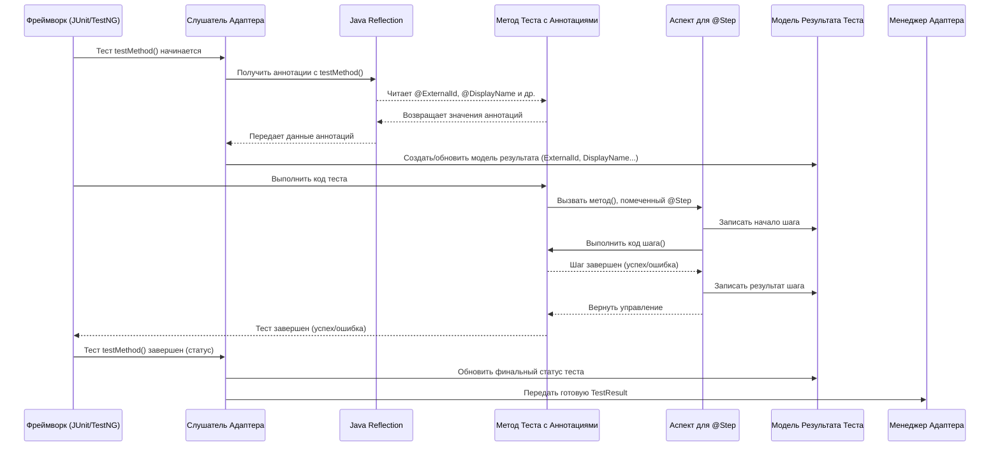

# Chapter 2: Аннотации для Тестов


В [предыдущей главе "Конфигурация Адаптера"](01_конфигурация_адаптера_.md) мы разобрались, как настроить адаптер, чтобы он знал, куда и как отправлять результаты тестов. Мы указали адрес сервера Test IT, секретный ключ и ID проекта. Теперь наш адаптер готов к работе, но ему нужно еще кое-что: информация о самих тестах.

Представьте, что вы написали много автоматических тестов. Они выполняются, но как понять, какой тест что проверяет? Как связать автоматический тест с тест-кейсом, который описан вручную в системе управления тестированием (TMS), такой как Test IT? Как добавить понятное описание или прикрепить ссылку на связанную задачу?

Именно для этого и нужны **Аннотации для Тестов**.

## Что такое аннотации и зачем они нужны?

Аннотации в Java — это специальные метки (начинаются с символа `@`), которые можно добавлять прямо в код перед классами, методами или переменными. Они не меняют логику работы кода, но несут дополнительную информацию – **метаданные**.

В контексте `adapters-java` аннотации — это как стикеры или ярлыки, которые мы "наклеиваем" на наши автотесты. Адаптер Test IT во время выполнения тестов "читает" эти стикеры и использует информацию с них, чтобы сделать отчеты в Test IT более полными и полезными.

Основные задачи, которые решают аннотации:

1.  **Связь с Test IT:** Позволяют связать ваш автоматический тест с конкретным тест-кейсом в Test IT.
2.  **Понятные имена и описания:** Дают тестам человекочитаемые имена и описания, которые отображаются в отчетах.
3.  **Структурирование теста:** Помогают разбить тест на логические шаги.
4.  **Дополнительный контекст:** Позволяют прикреплять ссылки (например, на баги или требования) и метки (теги).

## Основные аннотации `adapters-java`

Давайте познакомимся с самыми важными аннотациями, которые предоставляет `adapters-java`.

### `@ExternalId`

Это одна из самых главных аннотаций. Она позволяет **связать ваш метод автотеста с существующим тест-кейсом в Test IT**. Значение аннотации – это **Внешний ID (External ID)** тест-кейса из Test IT.

```java
import ru.testit.annotations.ExternalId;
import org.junit.jupiter.api.Test; // Пример для JUnit 5

public class LoginTests {

    @Test
    @ExternalId("Login-001") // Этот тест связан с тест-кейсом с External ID "Login-001" в Test IT
    public void testSuccessfulLogin() {
        // ... код теста для успешного входа ...
        System.out.println("Тест на успешный логин выполнен");
    }
}
```

*   **Как это работает:** Когда адаптер видит `@ExternalId("Login-001")`, он понимает: результаты выполнения метода `testSuccessfulLogin` нужно отправить для тест-кейса с External ID `Login-001` в вашем проекте Test IT.
*   **Где взять External ID:** Вы задаете его при создании или редактировании тест-кейса в интерфейсе Test IT. Он должен быть уникальным *в пределах вашего проекта*.

### `@WorkItemIds`

Эта аннотация позволяет **связать автотест с рабочими элементами (Work Items)** в Test IT. Рабочие элементы – это обычно задачи, пользовательские истории или дефекты, которые связаны с вашим тест-кейсом. Указывается **Глобальный ID (GID)** рабочего элемента из Test IT. Можно указать несколько ID.

```java
import ru.testit.annotations.ExternalId;
import ru.testit.annotations.WorkItemIds;
import org.junit.jupiter.api.Test;

public class FeatureTests {

    @Test
    @ExternalId("Feat-123")
    @WorkItemIds({"REQ-50", "BUG-99"}) // Связываем с требованием REQ-50 и багом BUG-99
    public void testNewFeature() {
        // ... код теста для новой функциональности ...
        System.out.println("Тест новой фичи выполнен");
    }
}
```

*   **Как это работает:** Адаптер передаст эти ID в Test IT вместе с результатами. В Test IT вы сможете легко увидеть, какие рабочие элементы покрываются этим автотестом.

### `@DisplayName`

По умолчанию в отчетах используется имя метода теста (например, `testSuccessfulLogin`). `@DisplayName` позволяет задать **более понятное, человекочитаемое имя** для теста, которое будет отображаться в Test IT.

```java
import ru.testit.annotations.ExternalId;
import ru.testit.annotations.DisplayName;
import org.junit.jupiter.api.Test;

public class LoginTests {

    @Test
    @ExternalId("Login-001")
    @DisplayName("Проверка успешного входа пользователя") // Понятное имя для отчета
    public void testSuccessfulLogin() {
        // ... код теста ...
        System.out.println("Тест на успешный логин выполнен");
    }
}
```

*   **Как это работает:** Адаптер считает значение `"Проверка успешного входа пользователя"` и отправит его как имя тест-поинта (результата теста) в Test IT.

### `@Description`

Эта аннотация позволяет добавить **подробное описание** к тесту. Это описание также будет видно в Test IT и может содержать контекст, предусловия или ожидаемый результат.

```java
import ru.testit.annotations.*; // Импортируем все аннотации для краткости
import org.junit.jupiter.api.Test;

public class LoginTests {

    @Test
    @ExternalId("Login-002")
    @DisplayName("Проверка входа с неверным паролем")
    @Description("Попытка входа с корректным логином, но неверным паролем. Ожидается сообщение об ошибке.")
    public void testLoginWithWrongPassword() {
        // ... код теста ...
        System.out.println("Тест с неверным паролем выполнен");
    }
}
```

*   **Как это работает:** Адаптер отправит текст из `@Description` в поле описания результата теста в Test IT.

### `@Link` и `@Links`

Позволяют **прикрепить одну или несколько ссылок** к результату теста. Это могут быть ссылки на задачи в баг-трекере, документацию, требования и т.д.

`@Link` имеет несколько атрибутов:
*   `url`: Сама ссылка (обязательный).
*   `title`: Название ссылки (необязательный).
*   `description`: Описание ссылки (необязательный).
*   `type`: Тип ссылки (один из `LinkType`: `RELATED`, `BLOCKED_BY`, `DEFECT`, `ISSUE`, `REQUIREMENT`, `REPOSITORY`).

```java
import ru.testit.annotations.*;
import ru.testit.models.LinkType; // Не забываем импортировать LinkType
import org.junit.jupiter.api.Test;

public class BugReproductionTests {

    @Test
    @ExternalId("BUG-REP-999")
    @DisplayName("Воспроизведение бага #999")
    @WorkItemIds({"BUG-999"})
    @Link(
        url = "https://jira.example.com/browse/BUG-999",
        title = "Баг в Jira",
        description = "Оригинальный тикет в Jira",
        type = LinkType.DEFECT // Указываем тип ссылки
    )
    @Link(url = "https://wiki.example.com/featureX", type = LinkType.REQUIREMENT) // Еще одна ссылка
    public void reproduceBug999() {
        // ... код, воспроизводящий баг ...
        System.out.println("Тест на воспроизведение бага выполнен");
        // Assert.fail("Баг воспроизвелся"); // Пример падения теста
    }

    // Если ссылок много, можно использовать @Links
    @Test
    @ExternalId("Bulk-Links-Test")
    @DisplayName("Тест с множеством ссылок")
    @Links(links = {
        @Link(url="http://example.com/1", type=LinkType.RELATED),
        @Link(url="http://example.com/2", title="Документация", type=LinkType.REQUIREMENT)
    })
    public void testWithMultipleLinks() {
        // ...
    }
}
```

*   **Как это работает:** Адаптер собирает все аннотации `@Link` (или `@Links`) и отправляет их как список ссылок вместе с результатами теста в Test IT.

### `@Labels`

Позволяет **добавить метки (теги)** к тесту. Это удобно для категоризации тестов (например, `smoke`, `regression`, `api`, `ui`).

```java
import ru.testit.annotations.*;
import org.junit.jupiter.api.Test;

public class SearchTests {

    @Test
    @ExternalId("Search-005")
    @DisplayName("Поиск по частичному совпадению")
    @Labels({"smoke", "search", "frontend"}) // Добавляем три метки
    public void testPartialMatchSearch() {
        // ... код теста ...
        System.out.println("Тест поиска выполнен");
    }
}
```

*   **Как это работает:** Адаптер отправит список меток (`smoke`, `search`, `frontend`) в Test IT, где они будут привязаны к результату теста.

### `@Step`

Эта аннотация используется для **обозначения методов, которые являются шагами внутри вашего теста**. Это позволяет получить более детальный отчет в Test IT, где будет видно, какие шаги выполнялись внутри теста и какие из них прошли успешно, а какие – нет.

```java
import ru.testit.annotations.*;
import org.junit.jupiter.api.Test;
import static org.junit.jupiter.api.Assertions.*; // Для assert

public class OrderProductTest {

    @Test
    @ExternalId("Order-001")
    @DisplayName("Успешное создание заказа")
    @Labels({"regression", "order"})
    public void testSuccessfulOrderCreation() {
        openLoginPage();
        login("user", "password");
        navigateToProduct("Laptop");
        addProductToCart();
        checkout();
        verifyOrderSuccess();
    }

    @Step // Помечаем метод как шаг
    public void openLoginPage() {
        System.out.println("Шаг: Открытие страницы входа");
        // ... код для открытия страницы ...
    }

    @Step // И этот
    public void login(String username, String password) {
        System.out.println("Шаг: Вход с пользователем " + username);
        // ... код для входа ...
        assertTrue(true); // Пример проверки внутри шага
    }

    @Step // И этот
    public void navigateToProduct(String productName) {
        System.out.println("Шаг: Переход к товару " + productName);
        // ... код навигации ...
    }

    @Step
    public void addProductToCart() {
        System.out.println("Шаг: Добавление товара в корзину");
        // ... код добавления в корзину ...
        // Если здесь произойдет ошибка (Exception), шаг отметится как FAILED
    }

    @Step
    public void checkout() {
        System.out.println("Шаг: Оформление заказа");
        // ... код оформления ...
    }

    @Step
    public void verifyOrderSuccess() {
        System.out.println("Шаг: Проверка успешности заказа");
        // ... код проверки ...
        assertTrue(true);
    }
}
```

*   **Как это работает:** Адаптер использует специальную "магию" (Аспектно-Ориентированное Программирование, AOP, с помощью библиотеки AspectJ), чтобы перехватывать вызовы методов, помеченных аннотацией `@Step`. Он автоматически записывает начало шага, его параметры (если есть), результат (успех/неудача) и время выполнения. Эта информация отправляется в Test IT и отображается как вложенные шаги внутри результата теста. Мы подробнее коснемся этого аспекта (`StepAspect.java`) ниже.

## Как адаптер обрабатывает аннотации?

Давайте заглянем немного "под капот", чтобы понять, как это работает.

1.  **Запуск теста:** Вы запускаете свои тесты как обычно (например, через Maven, Gradle или IDE).
2.  **Перехват событий:** В ваш проект добавлены специальные "слушатели" адаптера ([Слушатели событий фреймворков](04_слушатели_событий_фреймворков_.md)), например, для JUnit или TestNG. Эти слушатели уведомляются фреймворком о событиях жизненного цикла теста (старт, успех, падение, пропуск).
3.  **Чтение аннотаций:** Когда тест (например, метод `testSuccessfulLogin`) собирается запуститься, слушатель использует механизм **Java Reflection**. Reflection позволяет программе анализировать собственный код во время выполнения. Слушатель "смотрит" на метод теста и ищет на нем аннотации, такие как `@ExternalId`, `@DisplayName`, `@Link` и другие.
4.  **Сбор данных:** Информация из найденных аннотаций (например, `"Login-001"`, `"Проверка успешного входа..."`) извлекается и сохраняется вместе с другой информацией о тесте (имя класса, имя метода) в специальный объект – [Модель Результатов Тестирования](03_модели_результатов_тестирования_.md).
5.  **Обработка `@Step`:** Аннотация `@Step` обрабатывается немного иначе. Используется AOP (AspectJ). Специальный код (`StepAspect.java`) "встраивается" вокруг вызовов методов, помеченных `@Step`. Он автоматически фиксирует начало, конец, параметры и возможные ошибки шага, обновляя информацию о текущем выполняемом тесте.
6.  **Отправка результатов:** После завершения теста (успешного или неуспешного) слушатель передает собранную модель результата [Менеджеру Адаптера](06_менеджеру_адаптера_.md), который, в свою очередь, использует [Клиент API](07_клиент_api_и_запись_результатов_.md) для отправки этих обогащенных данных на сервер Test IT.

**Упрощенная схема:**



### Немного о коде аннотаций и аспектов

Сами аннотации определены очень просто. Вот пример `@ExternalId`:

```java
// Файл: testit-java-commons/src/main/java/ru/testit/annotations/ExternalId.java
package ru.testit.annotations;

import java.lang.annotation.ElementType;
import java.lang.annotation.Retention;
import java.lang.annotation.RetentionPolicy;
import java.lang.annotation.Target;

// @Retention(RetentionPolicy.RUNTIME): Важно! Говорит Java сохранять аннотацию
//                                      до момента выполнения, чтобы ее можно было прочитать Reflection.
@Retention(RetentionPolicy.RUNTIME)
// @Target({ ElementType.METHOD }): Указывает, что аннотацию можно ставить только на методы.
@Target({ ElementType.METHOD })
public @interface ExternalId {
    // value() - это параметр аннотации, куда мы передаем строку с External ID.
    String value();
}
```

Аннотация `@Step` немного сложнее из-за использования AspectJ. Вот упрощенный фрагмент аспекта, который "оборачивает" методы с `@Step`:

```java
// Файл: testit-java-commons/src/main/java/ru/testit/aspects/StepAspect.java
package ru.testit.aspects;

import org.aspectj.lang.JoinPoint;
import org.aspectj.lang.annotation.*;
import ru.testit.models.ItemStatus;
import ru.testit.models.StepResult;
import ru.testit.services.AdapterManager; // Ссылка на Менеджер Адаптера

@Aspect // Помечаем класс как аспект AspectJ
public class StepAspect {
    // Получаем текущий менеджер адаптера для записи шагов
    private static final InheritableThreadLocal<AdapterManager> adapterManager = /* ... */;

    // Определяем "точку среза": любой метод с аннотацией @Step
    @Pointcut("@annotation(ru.testit.annotations.Step)")
    public void withStepAnnotation() {}

    @Pointcut("execution(* *(..))") // Любой метод
    public void anyMethod() {}

    // @Before: Этот код выполнится ПЕРЕД вызовом метода, помеченного @Step
    @Before("anyMethod() && withStepAnnotation()")
    public void startStep(final JoinPoint joinPoint) {
        // ... (извлекаем имя метода, параметры) ...
        final StepResult result = new StepResult()
                .setName(/* ... имя ... */)
                .setDescription(/* ... описание ... */)
                .setParameters(/* ... параметры ... */);
        // Сообщаем менеджеру адаптера о начале нового шага
        getManager().startStep(UUID.randomUUID().toString(), result);
    }

    // @AfterReturning: Выполнится ПОСЛЕ успешного завершения метода @Step
    @AfterReturning(value = "anyMethod() && withStepAnnotation()")
    public void finishStep() {
        // Обновляем статус шага на PASSED
        getManager().updateStep(s -> s.setItemStatus(ItemStatus.PASSED));
        // Сообщаем менеджеру о завершении шага
        getManager().stopStep();
    }

    // @AfterThrowing: Выполнится, если метод @Step выбросил исключение (ошибку)
    @AfterThrowing(value = "anyMethod() && withStepAnnotation()", throwing = "throwable")
    public void failedStep(final Throwable throwable) {
        // Обновляем статус шага на FAILED и сохраняем информацию об ошибке
        getManager().updateStep(s ->
                s.setItemStatus(ItemStatus.FAILED).setThrowable(throwable));
        // Сообщаем менеджеру о завершении шага (неудачном)
        getManager().stopStep();
    }

    private AdapterManager getManager() {
        return adapterManager.get();
    }
}
```

Вам не нужно глубоко разбираться в AspectJ, чтобы использовать `@Step`. Главное – понимать, что эта аннотация позволяет адаптеру автоматически отслеживать выполнение отдельных частей вашего теста.

## Заключение

Аннотации `@ExternalId`, `@DisplayName`, `@WorkItemIds`, `@Description`, `@Link`, `@Labels` и `@Step` — это ваш основной инструмент для обогащения результатов автотестов информацией, необходимой для Test IT. Они делают отчеты понятными, обеспечивают связь с тест-кейсами и требованиями, а также позволяют детализировать выполнение теста с помощью шагов. Используя эти "стикеры" в своем коде, вы значительно повышаете ценность автоматизации тестирования.

Теперь, когда мы знаем, как добавлять метаданные к нашим тестам с помощью аннотаций, в следующей главе мы рассмотрим, как вся эта информация (вместе со статусом выполнения, временем, ошибками и шагами) упаковывается в специальные структуры данных перед отправкой в Test IT.

**Следующая глава:** [Модели Результатов Тестирования](03_модели_результатов_тестирования_.md)

---

Generated by [AI Codebase Knowledge Builder](https://github.com/The-Pocket/Tutorial-Codebase-Knowledge)