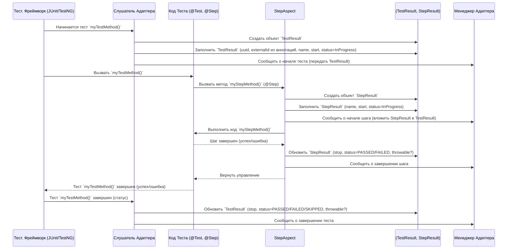

# Chapter 3: Модели Результатов Тестирования


В [предыдущей главе "Аннотации для Тестов"](02_аннотации_для_тестов_.md) мы научились "украшать" наши тесты специальными метками (аннотациями), чтобы передать дополнительную информацию: связь с Test IT, понятные имена, описания, ссылки и шаги. Адаптер собирает всю эту информацию, а также данные о ходе выполнения теста (прошел он, упал или был пропущен), времени его работы, ошибках и т.д.

Но куда вся эта информация складывается перед тем, как отправиться в Test IT? Представьте, что вы заполняете отчет о командировке: у вас есть квитанции (данные), но вам нужна стандартная форма (бланк отчета), чтобы все структурировать и ничего не забыть.

**Модели Результатов Тестирования** — это и есть такие "стандартные формы" или "контейнеры" для данных в `adapters-java`. Это заранее определенные Java-классы, которые служат структурой для хранения всей информации о результатах выполнения тестов, шагов и вспомогательных методов.

## Зачем нужны специальные модели?

1.  **Стандартизация:** Они гарантируют, что все необходимые данные будут собраны в едином формате. Test IT ожидает информацию в определенном виде, и модели помогают этому соответствовать.
2.  **Полнота:** Модели включают поля для всех возможных данных, которые могут понадобиться: статус, время, ошибки, шаги, вложения, ссылки, метки и т.д. Это как чек-лист, помогающий ничего не упустить.
3.  **Удобство передачи:** Собранные и упакованные в эти модели данные легко передавать между компонентами адаптера (например, от [Слушателя событий фреймворков](04_слушатели_событий_фреймворков_.md) к [Клиенту API](07_клиент_api_и_запись_результатов_.md)) и отправлять на сервер Test IT.

Вам, как пользователю адаптера, обычно не нужно *создавать* эти объекты вручную. [Слушатели событий фреймворков](04_слушатели_событий_фреймворков_.md) и механизм обработки `@Step` делают это автоматически. Но понимание их структуры полезно, чтобы знать, какая информация собирается и как она будет выглядеть в Test IT.

## Основные модели (Классы-Контейнеры)

Давайте познакомимся с главными "формами отчетов".

### `TestResult` - Отчет о Тесте

Это главный контейнер, содержащий всю информацию о конкретном автотесте (методе, помеченном как `@Test` или аналогом).

```java
// Упрощенный пример из TestResult.java
package ru.testit.models;

import java.util.List;
import java.util.Map;
// ... другие импорты ...

public class TestResult /* ... */ {
    private String uuid; // Уникальный ID для этого запуска теста
    private String externalId; // <<< Внешний ID из аннотации @ExternalId
    private List<String> workItemIds; // <<< ID связанных задач из @WorkItemIds
    private String name; // <<< Имя теста (из @DisplayName или имя метода)
    private String title; // <<< Заголовок (часто совпадает с name)
    private String description; // <<< Описание из @Description
    private ItemStatus itemStatus; // <<< Итоговый статус (PASSED, FAILED, SKIPPED)
    private ItemStage itemStage; // Стадия (RUNNING, FINISHED)
    private Long start; // Время начала теста (timestamp)
    private Long stop; // Время окончания теста (timestamp)
    private Throwable throwable; // <<< Информация об ошибке, если тест упал
    private List<StepResult> steps; // <<< Список шагов внутри теста (из @Step)
    private List<Label> labels; // <<< Метки из @Labels
    private List<LinkItem> linkItems; // <<< Ссылки из @Link / @Links
    private List<String> attachments; // <<< Список имен прикрепленных файлов
    private Map<String, String> parameters; // Параметры теста (если используются)

    // Методы для установки и получения значений (сеттеры и геттеры)
    // public String getExternalId() { return externalId; }
    // public TestResult setExternalId(String externalId) { ... }
    // ... и так далее для всех полей ...
}
```

**Ключевые поля (на что обратить внимание):**

*   `externalId`, `workItemIds`, `name`, `title`, `description`, `labels`, `linkItems`: Эти поля в основном заполняются информацией из [Аннотаций для Тестов](02_аннотации_для_тестов_.md).
*   `itemStatus`, `itemStage`, `start`, `stop`, `throwable`: Эти поля заполняются [Слушателями событий фреймворков](04_слушатели_событий_фреймворков_.md) на основе реального выполнения теста.
*   `steps`: Список объектов `StepResult`, заполняемый при использовании аннотации `@Step`.
*   `attachments`: Список имен файлов, добавленных как вложения во время теста (например, скриншоты).

### `StepResult` - Отчет о Шаге

Если ваш тест разбит на шаги с помощью аннотации `@Step`, то для каждого шага создается объект `StepResult`. Эти объекты хранятся внутри соответствующего `TestResult`.

```java
// Упрощенный пример из StepResult.java
package ru.testit.models;

import java.util.List;
import java.util.Map;
// ... другие импорты ...

public class StepResult /* ... */ {
    private String name; // Имя шага (из названия метода @Step)
    private String description; // Описание (можно добавить программно)
    private ItemStatus itemStatus; // Статус шага (PASSED, FAILED, SKIPPED)
    private ItemStage itemStage; // Стадия (RUNNING, FINISHED)
    private Long start; // Время начала шага
    private Long stop; // Время окончания шага
    private Throwable throwable; // Ошибка, если шаг упал
    private List<StepResult> steps; // <<< Вложенные шаги (если шаг вызывает другой шаг)
    private List<LinkItem> linkItems; // Ссылки, добавленные внутри шага
    private List<String> attachments; // Вложения, добавленные внутри шага
    private Map<String, String> parameters; // Параметры, переданные в метод шага

    // ... сеттеры и геттеры ...
}
```

**Ключевые поля:**

*   Очень похож на `TestResult`, но описывает меньшую единицу – шаг.
*   `steps`: Позволяет создавать иерархию шагов (шаги внутри шагов).
*   Заполняется автоматически аспектом `StepAspect` при вызове методов, помеченных `@Step`.

### `FixtureResult` - Отчет о Подготовке/Завершении

Тестовые фреймворки (JUnit, TestNG) часто имеют специальные методы для настройки окружения *перед* тестом (`setup`, `@BeforeEach`, `@BeforeAll`) и для очистки *после* теста (`teardown`, `@AfterEach`, `@AfterAll`). Эти методы называются "фикстурами" (fixtures). Информация об их выполнении (успех, ошибка, время) также важна и собирается в объекты `FixtureResult`.

```java
// Упрощенный пример из FixtureResult.java
package ru.testit.models;
// ... другие импорты ...

// По структуре очень похож на StepResult
public class FixtureResult /* ... */ {
    private String name; // Имя метода фикстуры (e.g., "setUp", "tearDown")
    private ItemStatus itemStatus; // Статус выполнения (PASSED, FAILED)
    private ItemStage itemStage; // Стадия (RUNNING, FINISHED)
    private String description;
    private List<StepResult> steps; // Шаги внутри фикстуры (если используются)
    private List<LinkItem> linkItems; // Ссылки
    private List<String> attachments; // Вложения
    private Long start;
    private Long stop;
    private Map<String, String> parameters;

    // ... сеттеры и геттеры ...
}
```

**Ключевые поля:**

*   Собирает информацию о методах setup/teardown.
*   Если метод `@BeforeEach` упадет, это будет отражено в соответствующем `FixtureResult`, и сам тест, скорее всего, будет помечен как `SKIPPED` или `FAILED`.
*   Заполняется [Слушателями событий фреймворков](04_слушатели_событий_фреймворков_.md).

### Вспомогательные Модели и Перечисления

Помимо основных "контейнеров", есть и более мелкие структуры и перечисления (enum), которые используются внутри них:

*   **`ItemStatus`:** Определяет возможные статусы результата (теста, шага, фикстуры).
    ```java
    package ru.testit.models;
    public enum ItemStatus {
        PASSED("Passed"),   // Пройден успешно
        FAILED("Failed"),   // Упал (была ошибка)
        SKIPPED("Skipped"), // Пропущен (не выполнялся)
        INPROGRESS("InProgress"), // В процессе выполнения (редко используется в финальном отчете)
        BLOCKED("Blocked"); // Заблокирован (редко используется адаптерами)
        // ...
    }
    ```
*   **`ItemStage`:** Определяет стадию жизненного цикла элемента.
    ```java
    package ru.testit.models;
    public enum ItemStage {
        RUNNING("running"),   // Выполняется сейчас
        FINISHED("finished"), // Выполнение завершено
        SCHEDULED("scheduled"), // Запланирован (еще не начался)
        PENDING("pending");   // Ожидает (например, своей очереди)
        // ...
    }
    ```
*   **`LinkItem`:** Представляет одну ссылку (из аннотации `@Link`).
    ```java
    package ru.testit.models;
    public class LinkItem {
        private String title; // Название ссылки
        private String url;   // URL адрес
        private String description; // Описание
        private LinkType type; // Тип ссылки (Defect, Issue, Requirement, etc.)
        // ... сеттеры и геттеры ...
    }
    ```
*   **`Label`:** Представляет одну метку (из аннотации `@Labels`).
    ```java
    package ru.testit.models;
    public class Label {
        private String name; // Имя метки (тега)
        // ... сеттеры и геттеры ...
    }
    ```
*   **`ClassContainer`, `MainContainer`:** Это вспомогательные контейнеры, используемые некоторыми слушателями для группировки результатов по классам или общим фикстурам. Обычно вам не нужно с ними напрямую взаимодействовать.

## Как Модели Заполняются? (Общая Схема)

Представим упрощенный процесс для одного теста с одним шагом:



**Что происходит:**

1.  **Старт Теста:** Слушатель создает `TestResult` и заполняет его начальной информацией (ID, имена из аннотаций, время старта).
2.  **Старт Шага:** `StepAspect` перехватывает вызов метода с `@Step`, создает `StepResult`, заполняет его и "вкладывает" в текущий `TestResult`.
3.  **Конец Шага:** `StepAspect` обновляет `StepResult` (время окончания, статус, ошибка если была).
4.  **Конец Теста:** Слушатель обновляет `TestResult` финальным статусом, временем и ошибкой (если была).
5.  **Передача Менеджеру:** На каждом этапе (старт/стоп теста, старт/стоп шага) информация передается [Менеджеру Адаптера](06_менеджеру_адаптера_.md), который решает, что с ней делать дальше (например, отправить в Test IT через [Клиент API](07_клиент_api_и_запись_результатов_.md)).

## Заключение

Модели Результатов Тестирования (`TestResult`, `StepResult`, `FixtureResult` и другие) — это стандартизированные "контейнеры данных" в `adapters-java`. Они служат для структурированного хранения всей информации, собранной во время выполнения автотестов: метаданных из аннотаций, статусов выполнения, временных меток, ошибок, шагов, вложений и ссылок.

Хотя вам редко придется создавать или изменять эти объекты вручную, понимание их структуры помогает лучше представить, какие данные ваш адаптер собирает и отправляет в Test IT. Эти модели обеспечивают согласованность и полноту отчетов.

В следующей главе мы подробнее рассмотрим компоненты, которые отвечают за *заполнение* этих моделей данными во время выполнения тестов, — [Слушатели событий фреймворков](04_слушатели_событий_фреймворков_.md).

**Следующая глава:** [Слушатели событий фреймворков](04_слушатели_событий_фреймворков_.md)

---

Generated by [AI Codebase Knowledge Builder](https://github.com/The-Pocket/Tutorial-Codebase-Knowledge)