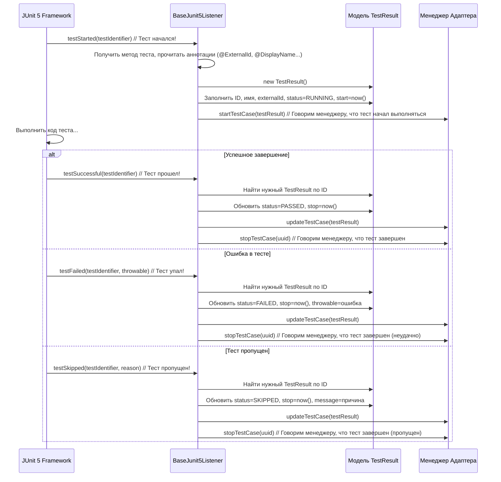

# Chapter 4: Слушатели событий фреймворков


В [предыдущей главе "Модели Результатов Тестирования"](03_модели_результатов_тестирования_.md) мы узнали, что `adapters-java` использует специальные "контейнеры" (`TestResult`, `StepResult`) для сбора всей информации о выполненных тестах. Но кто заполняет эти контейнеры данными? Откуда адаптер узнает, что тест начался, закончился успешно или провалился, или что был выполнен определенный шаг?

Именно здесь в игру вступают **Слушатели событий фреймворков**.

## Репортер на матче: Зачем нужны слушатели?

Представьте себе спортивный матч (например, футбольный). Чтобы зрители, которые не могут быть на стадионе, узнали о ходе игры, нужен репортер. Репортер внимательно следит за матчем, фиксирует ключевые моменты – начало игры, голы, нарушения, замены, финальный свисток – и оперативно передает эту информацию в редакцию (или ведет прямой репортаж).

**Слушатели событий фреймворков** в `adapters-java` выполняют роль таких репортеров для ваших автоматических тестов. Каждый тестовый фреймворк (JUnit 4, JUnit 5, TestNG, Cucumber, JBehave и т.д.) во время выполнения тестов генерирует различные "события":

*   Тест начался
*   Тест успешно завершился
*   Тест завершился с ошибкой
*   Тест был пропущен
*   Начался шаг внутри теста (для BDD и `@Step`)
*   Закончился шаг внутри теста
*   Начался метод подготовки (`@BeforeEach`)
*   Завершился метод очистки (`@AfterAll`)

Сами по себе эти события специфичны для каждого фреймворка. Адаптеру Test IT нужен унифицированный способ получать информацию о них. Вот тут и нужны слушатели.

**Слушатель** — это компонент `adapters-java`, специально "настроенный" на язык конкретного тестового фреймворка. Он "слушает" сообщения, которые посылает фреймворк, и действует как переводчик и репортер:

1.  **Перехватывает (Слушает):** Ловит специфичные для фреймворка сигналы о событиях.
2.  **Интерпретирует и Собирает Данные:** Понимает, что означает событие (например, "тест упал"), и собирает сопутствующую информацию: имя теста, время, детали ошибки, а также данные из [Аннотаций для Тестов](02_аннотации_для_тестов_.md) (например, `@ExternalId`), используя Java Reflection.
3.  **Заполняет Модель:** Упаковывает собранную информацию в стандартный "бланк отчета" — объект [Модели Результатов Тестирования](03_модели_результатов_тестирования_.md) (например, `TestResult`).
4.  **Передает Дальше:** Отправляет заполненную модель [Менеджеру Адаптера](06_менеджер_адаптера_.md) для дальнейшей обработки.

Без слушателей адаптер оставался бы "глух" к тому, что происходит во время выполнения тестов, и не смог бы собрать нужную информацию для отправки в Test IT.

## Как это работает: Слушатели для разных фреймворков

Поскольку каждый фреймворк "говорит" на своем языке (имеет свой API для событий), `adapters-java` предоставляет отдельные реализации слушателей для каждого поддерживаемого фреймворка:

*   `BaseJunit4Listener` и `BaseJunit4Runner` (для JUnit 4)
*   `BaseJunit5Listener` (для JUnit 5)
*   `BaseTestNgListener` (для TestNG)
*   `BaseCucumber4Listener` (для Cucumber 4)
*   `BaseCucumber5Listener` (для Cucumber 5)
*   `BaseCucumber6Listener` (для Cucumber 6)
*   `BaseCucumber7Listener` (для Cucumber 7)
*   `BaseJbehaveListener` (для JBehave)
*   `SelenideListener` (специальный слушатель для Selenide, работающий поверх основного фреймворка)

Вам, как пользователю, обычно **не нужно писать код слушателя**. Вам нужно только правильно подключить и настроить уже готовый слушатель из библиотеки `adapters-java` для вашего тестового фреймворка. Эта настройка обычно делается в конфигурации вашего инструмента сборки (Maven или Gradle) или через настройки самого тестового фреймворка.

**Пример (концептуальный):**

Представьте, вы используете JUnit 5. Когда вы запускаете тесты, и JUnit 5 обнаруживает тест, он генерирует событие "test started". Если `BaseJunit5Listener` подключен, он перехватит это событие. Затем он:

1.  Посмотрит на метод теста с помощью Reflection.
2.  Найдет аннотации `@ExternalId`, `@DisplayName` и др.
3.  Создаст объект `TestResult`.
4.  Заполнит `TestResult` именем, External ID, временем начала и статусом "выполняется".
5.  Вызовет метод `adapterManager.startTestCase(testResult)`.

Когда тест завершится (успешно или с ошибкой), JUnit 5 сгенерирует событие "test finished". `BaseJunit5Listener` снова перехватит его, обновит соответствующий `TestResult` финальным статусом, временем окончания, информацией об ошибке (если была) и вызовет `adapterManager.stopTestCase(uuid)`.

## Заглянем внутрь: Жизненный цикл теста глазами слушателя

Давайте рассмотрим упрощенную схему взаимодействия для JUnit 5:



Эта схема показывает основную идею: слушатель реагирует на события фреймворка и транслирует их в вызовы методов [Менеджера Адаптера](06_менеджер_адаптера_.md), передавая ему актуальную информацию в виде объектов [Модели Результатов Тестирования](03_модели_результатов_тестирования_.md).

## Пример кода слушателя (упрощенно)

Давайте посмотрим на очень упрощенный фрагмент кода из `BaseJunit5Listener` (файл `testit-adapter-junit5/src/main/java/ru/testit/listener/BaseJunit5Listener.java`), чтобы увидеть, как это происходит на практике.

```java
// Упрощенный пример из BaseJunit5Listener.java

import org.junit.jupiter.api.extension.*;
import ru.testit.models.*;
import ru.testit.services.Adapter;
import ru.testit.services.AdapterManager;
import ru.testit.services.ExecutableTest;
import java.lang.reflect.Method; // Для чтения аннотаций
import java.util.Map;
import java.util.UUID;

public class BaseJunit5Listener implements /* ... интерфейсы JUnit 5 ... */ TestWatcher {

    private final AdapterManager adapterManager;
    private final ThreadLocal<ExecutableTest> executableTest = ThreadLocal.withInitial(ExecutableTest::new);
    // ... другие поля ...

    public BaseJunit5Listener() {
        // Получаем экземпляр менеджера адаптера
        adapterManager = Adapter.getAdapterManager();
    }

    // Метод, вызываемый ПЕРЕД выполнением теста (часть InvocationInterceptor)
    @Override
    public void interceptTestMethod(
            /* ... параметры JUnit 5 ... */
            ExtensionContext extensionContext
    ) throws Throwable {
        // Получаем текущий "контейнер" для информации о тесте
        ExecutableTest currentTest = this.executableTest.get();
        // ... (проверка, не начат ли уже другой тест в этом потоке) ...
        currentTest.setTestStatus(); // Помечаем, что тест активен

        final String uuid = currentTest.getUuid(); // Генерируем уникальный ID для этого ЗАПУСКА теста
        startTestCase(extensionContext.getRequiredTestMethod(), uuid, null); // Заполняем детали и сообщаем менеджеру

        // ... (сообщаем контейнеру класса, что этот тест в нем) ...

        invocation.proceed(); // Запускаем сам тест
    }

    // Вспомогательный метод для создания и отправки TestResult
    protected void startTestCase(Method method, final String uuid, Map<String, String> parameters) {
        // Создаем объект TestResult
        final TestResult result = new TestResult()
                .setUuid(uuid)
                // Считываем аннотации с помощью Reflection (через утилиты)
                .setExternalId(Utils.extractExternalID(method, parameters))
                .setName(Utils.extractDisplayName(method, parameters))
                .setWorkItemIds(Utils.extractWorkItemId(method, parameters))
                .setLinkItems(Utils.extractLinks(method, parameters))
                .setDescription(Utils.extractDescription(method, parameters))
                // ... (устанавливаем другие поля) ...
                .setItemStatus(ItemStatus.RUNNING); // Начальный статус

        // Сообщаем менеджеру, что тест запланирован (готов к запуску)
        adapterManager.scheduleTestCase(result);
        // Сообщаем менеджеру, что тест НАЧАЛСЯ
        adapterManager.startTestCase(uuid);
    }

    // Метод, вызываемый ПОСЛЕ УСПЕШНОГО завершения теста (из TestWatcher)
    @Override
    public void testSuccessful(ExtensionContext context) {
        final ExecutableTest currentTest = this.executableTest.get();
        currentTest.setAfterStatus(); // Помечаем, что тест закончил выполняться

        // Сообщаем менеджеру об успешном завершении
        adapterManager.updateTestCase(currentTest.getUuid(), result -> result.setItemStatus(ItemStatus.PASSED));
        adapterManager.stopTestCase(currentTest.getUuid());
    }

    // Метод, вызываемый ПОСЛЕ НЕУДАЧНОГО завершения теста (из TestWatcher)
    @Override
    public void testFailed(ExtensionContext context, Throwable cause) {
        final ExecutableTest currentTest = this.executableTest.get();
        currentTest.setAfterStatus();

        // Сообщаем менеджеру о провале, передаем ошибку
        adapterManager.updateTestCase(currentTest.getUuid(), result -> {
            result.setItemStatus(ItemStatus.FAILED);
            result.setThrowable(cause); // Прикрепляем детали ошибки
        });
        adapterManager.stopTestCase(currentTest.getUuid());
    }

    // Метод, вызываемый ПОСЛЕ ПРОПУСКА теста (из TestWatcher)
    @Override
    public void testAborted(ExtensionContext context, Throwable cause) {
         // Похоже на testFailed, но статус SKIPPED
         // ...
    }

    // Есть также методы для перехвата @BeforeAll, @AfterAll, @BeforeEach, @AfterEach (фикстур)
    // ...
}
```

**Ключевые моменты:**

*   Слушатель реализует интерфейсы, предоставляемые тестовым фреймворком (здесь `TestWatcher`, `InvocationInterceptor` и др. для JUnit 5).
*   Фреймворк сам вызывает методы слушателя в нужные моменты (`interceptTestMethod`, `testSuccessful`, `testFailed`).
*   Внутри этих методов слушатель получает информацию о тесте (имя, аннотации, статус, ошибку).
*   Он использует `AdapterManager` для уведомления об этапах жизненного цикла теста (`scheduleTestCase`, `startTestCase`, `updateTestCase`, `stopTestCase`).
*   Он использует вспомогательные классы (`ExecutableTest`, `Utils`) для управления состоянием и извлечения метаданных из аннотаций.

## Слушатели для BDD фреймворков (Cucumber, JBehave)

Слушатели для BDD-фреймворков, таких как Cucumber (`BaseCucumber*Listener`) и JBehave (`BaseJbehaveListener`), немного сложнее. Помимо стандартных событий начала/конца теста (сценария), им нужно обрабатывать события шагов (`stepStarted`, `stepFinished`).

Кроме того, большая часть метаданных (External ID, DisplayName, WorkItem IDs, Links, Labels) в BDD-тестах обычно находится не в Java-аннотациях, а в виде тегов (`@ExternalId=...`, `@WI=...`) прямо в `.feature` файлах.

Поэтому слушатели Cucumber и JBehave тесно взаимодействуют с [Парсерами Сценариев/Тегов](05_парсеры_сценариев_тегов__cucumber_jbehave__.md), которые отвечают за чтение `.feature` файлов и извлечение этих метаданных из тегов.

Вот как выглядит фрагмент кода для Cucumber 7 (`testit-adapter-cucumber7/src/main/java/ru/testit/listener/BaseCucumber7Listener.java`):

```java
// Упрощенный пример из BaseCucumber7Listener.java
import io.cucumber.plugin.ConcurrentEventListener;
import io.cucumber.plugin.event.*;
import ru.testit.models.*;
import ru.testit.services.AdapterManager;
// ... другие импорты ...

public class BaseCucumber7Listener implements ConcurrentEventListener {
    private final AdapterManager adapterManager;
    private final ScenarioParser scenarioParser; // <<< Парсер .feature файлов
    private final ThreadLocal<TestCase> currentTestCase = new InheritableThreadLocal<>(); // Текущий сценарий
    // ... другие поля ...

    public BaseCucumber7Listener(AdapterManager adapterManager) {
        this.adapterManager = adapterManager;
        this.scenarioParser = new ScenarioParser(); // Используем парсер
    }

    // Вызывается при старте сценария (TestCase)
    private void testStarted(final TestCaseStarted event) {
        // ... (подготовка, получение текущего сценария, feature) ...
        currentTestCase.set(event.getTestCase());

        // Получаем теги сценария
        final Deque<String> tags = new LinkedList<>(currentTestCase.get().getTags());
        // << ВАЖНО: Создаем TagParser для извлечения данных из тегов >>
        final TagParser tagParser = new TagParser(feature, currentTestCase.get(), tags, parameters);

        final String uuid = getTestCaseUuid(currentTestCase.get()); // Генерируем ID

        // Создаем TestResult, используя ДАННЫЕ ИЗ ТЕГОВ, полученные парсером
        final TestResult result = new TestResult()
                .setUuid(uuid)
                .setExternalId(tagParser.getExternalId()) // <<< Из тега @ExternalId=...
                .setName(tagParser.getDisplayName())      // <<< Из тега @DisplayName=...
                .setWorkItemIds(tagParser.getWorkItemIds()) // <<< Из тегов @WI=...
                .setLinkItems(tagParser.getScenarioLinks()) // <<< Из тегов @Link=...
                .setLabels(tagParser.getScenarioLabels())   // <<< Из других тегов
                // ... (другие поля) ...
                .setItemStatus(ItemStatus.RUNNING);

        adapterManager.scheduleTestCase(result);
        adapterManager.startTestCase(uuid);
    }

    // Вызывается при завершении сценария
    private void testFinished(final TestCaseFinished event) {
        final String uuid = getTestCaseUuid(event.getTestCase());
        Throwable throwable = event.getResult().getError();
        ItemStatus status = convertStatus(event.getResult()); // Конвертируем статус Cucumber в статус Test IT

        // Обновляем TestResult финальным статусом и ошибкой (если была)
        adapterManager.updateTestCase(uuid, testResult -> {
            testResult.setItemStatus(status);
            if (throwable != null) {
                testResult.setThrowable(throwable);
            }
        });
        adapterManager.stopTestCase(uuid);
        // ...
    }

    // Вызывается при старте шага (Step)
    private void stepStarted(final TestStepStarted event) {
        if (event.getTestStep() instanceof PickleStepTestStep) { // Убеждаемся, что это реальный шаг сценария
            final PickleStepTestStep pickleStep = (PickleStepTestStep) event.getTestStep();
            // ... (получаем текст шага, ключевое слово Given/When/Then) ...

            // Создаем StepResult
            final StepResult stepResult = new StepResult()
                    .setName(String.format("%s %s", stepKeyword, pickleStep.getStep().getText()))
                    .setStart(System.currentTimeMillis())
                    .setItemStatus(ItemStatus.RUNNING);

            // Сообщаем менеджеру о начале шага
            adapterManager.startStep(getTestCaseUuid(currentTestCase.get()), getStepUuid(pickleStep), stepResult);
        }
        // ... (обработка хуков @BeforeStep, @AfterStep) ...
    }

    // Вызывается при завершении шага
    private void stepFinished(final TestStepFinished event) {
         if (event.getTestStep() instanceof PickleStepTestStep) {
            final ItemStatus stepStatus = convertStatus(event.getResult()); // Получаем PASSED/FAILED/SKIPPED
            String stepUuid = getStepUuid((PickleStepTestStep) event.getTestStep());

            // Обновляем статус шага
            adapterManager.updateStep(stepUuid, stepResult -> stepResult.setItemStatus(stepStatus));
            // Сообщаем менеджеру о завершении шага
            adapterManager.stopStep(stepUuid);

            // Если шаг упал, нужно обновить и статус всего сценария
            updateTestCaseStatus(stepStatus);

            if (!ItemStatus.PASSED.equals(stepStatus)) {
                 forbidTestCaseStatusChange.set(true); // Запрещаем менять статус сценария на PASSED, если хоть один шаг упал
            }
         }
         // ... (обработка хуков) ...
    }

    // ... другие методы и хелперы ...
}
```

## Заключение

Слушатели событий фреймворков — это незаменимые "уши" и "переводчики" адаптера Test IT. Они интегрируются с вашим любимым тестовым фреймворком (JUnit, TestNG, Cucumber и т.д.), перехватывают его внутренние события во время выполнения тестов, собирают всю необходимую информацию (включая метаданные из [Аннотаций для Тестов](02_аннотации_для_тестов_.md) или тегов) и упаковывают её в стандартные [Модели Результатов Тестирования](03_модели_результатов_тестирования_.md). Затем эта информация передается [Менеджеру Адаптера](06_менеджер_адаптера_.md) для дальнейшей обработки и отправки в Test IT.

Благодаря слушателям, адаптер может бесшовно работать с различными технологиями автоматизации, предоставляя вам единообразные и подробные отчеты в Test IT.

В следующей главе мы подробнее рассмотрим специфику работы с BDD-фреймворками и разберем, как [Парсеры Сценариев/Тегов](05_парсеры_сценариев_тегов__cucumber_jbehave__.md) помогают слушателям извлекать метаданные из `.feature` файлов.

**Следующая глава:** [Парсеры Сценариев/Тегов (Cucumber/JBehave)](05_парсеры_сценариев_тегов__cucumber_jbehave__.md)

---

Generated by [AI Codebase Knowledge Builder](https://github.com/The-Pocket/Tutorial-Codebase-Knowledge)