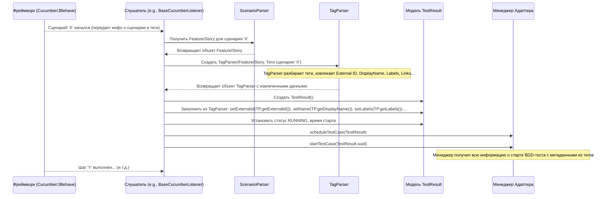

# Chapter 5: Парсеры Сценариев/Тегов (Cucumber/JBehave)


В [предыдущей главе "Слушатели событий фреймворков"](04_слушатели_событий_фреймворков_.md) мы узнали, как адаптер Test IT "узнает" о том, что происходит во время запуска тестов, используя специальные компоненты-репортеры — слушатели. Мы видели, как слушатели для JUnit и TestNG читают метаданные из [Аннотаций для Тестов](02_аннотации_для_тестов_.md) (например, `@ExternalId`).

Но что делать, если вы используете **BDD (Behavior-Driven Development)** фреймворки, такие как Cucumber или JBehave? В этих инструментах тесты описываются не только в Java-коде, но и в специальных текстовых файлах (`.feature` или `.story`) на почти естественном языке (Gherkin). Метаданные тестов в BDD часто указываются не через Java-аннотации, а через **теги** прямо в этих текстовых файлах.

**Проблема:** Как адаптеру понять этот специфичный BDD-формат и извлечь нужную информацию (External ID, Display Name, ссылки и т.д.) из тегов?

**Решение:** Для этого в `adapters-java` существуют специальные компоненты — **Парсеры Сценариев (`ScenarioParser`)** и **Парсеры Тегов (`TagParser`)**. Они выступают в роли переводчиков с языка BDD на язык, понятный адаптеру.

## Задачи парсеров

Представьте, что у вас есть инструкция на иностранном языке (файл `.feature`) с важными пометками на полях (теги). Парсеры делают следующее:

1.  **`ScenarioParser` (Анализатор структуры):** Он читает сам файл `.feature` или `.story` и разбирает его структуру – понимает, где начинается сценарий, где его шаги, к какому файлу он относится. Это похоже на понимание грамматики и структуры предложений в инструкции.
2.  **`TagParser` (Извлекатель пометок):** Он фокусируется на тегах (пометках на полях, например, `@ExternalId=XYZ-123`, `@DisplayName=Проверка_логина`, `@Labels=smoke,auth`) и извлекает из них конкретные метаданные, которые адаптер использует точно так же, как данные из Java-аннотаций.

Эти парсеры работают в тесной связке со [Слушателями событий фреймворков](04_слушатели_событий_фреймворков_.md) для Cucumber и JBehave. Слушатель знает, *когда* нужно получить информацию (например, при старте сценария), а парсеры знают, *как* её прочитать и извлечь из BDD-файлов и тегов.

## Как это используется на практике?

Давайте рассмотрим пример с Cucumber. У вас есть такой `.feature` файл:

```gherkin
# Файл: login.feature
Feature: Авторизация пользователя

  @ExternalId=AUTH-001  # <---- Связь с Test IT
  @DisplayName=Успешный вход пользователя # <---- Имя для отчета
  @Labels=smoke,p1      # <---- Метки
  @WorkItemIds=REQ-10,REQ-12 # <---- Связанные задачи
  Scenario: Successful login
    Given пользователь на странице входа
    When он вводит корректные "логин" и "пароль"
    Then он успешно авторизован
```

Когда вы запускаете этот тест:

1.  **Cucumber** читает `login.feature` и начинает выполнять сценарий "Successful login".
2.  **Слушатель** (например, `BaseCucumber7Listener`) получает от Cucumber событие о старте сценария.
3.  Слушателю нужна информация об этом сценарии (External ID, DisplayName и т.д.). Он **не** будет искать Java-аннотации, потому что это Cucumber.
4.  Вместо этого слушатель обращается к **`ScenarioParser`**, чтобы получить доступ к структуре `login.feature`.
5.  Затем слушатель использует **`TagParser`**, передавая ему теги, найденные для сценария (`@ExternalId=AUTH-OO1`, `@DisplayName=...`, `@Labels=...`, `@WorkItemIds=...`).
6.  **`TagParser`** "читает" эти теги, разбирает их (например, разделяет строку `@ExternalId=AUTH-001` на ключ `@ExternalId` и значение `AUTH-001`) и возвращает извлеченные данные слушателю.
7.  **Слушатель** получает от `TagParser` значения:
    *   External ID: `AUTH-001`
    *   DisplayName: `Успешный вход пользователя`
    *   Labels: `["smoke", "p1"]`
    *   WorkItem IDs: `["REQ-10", "REQ-12"]`
8.  Слушатель использует эти данные для заполнения объекта [Модели Результатов Тестирования](03_модели_результатов_тестирования_.md) (`TestResult`).
9.  Заполненный `TestResult` передается [Менеджеру Адаптера](06_менеджер_адаптера_.md) для дальнейшей обработки и отправки в Test IT.

Таким образом, парсеры позволяют бесшовно интегрировать BDD-тесты, переводя их теги в тот же формат метаданных, который используется для тестов на JUnit/TestNG с аннотациями.

## Заглянем внутрь: Как работают парсеры

### Общая схема взаимодействия



### `ScenarioParser` и `ScenarioStorage` (Чтение структуры)

`ScenarioParser` обычно использует встроенные возможности BDD-фреймворка или библиотеку Gherkin для разбора `.feature` или `.story` файлов. Его основная задача – предоставить доступ к структуре файла (Feature, Scenario, Steps) для слушателя.

Часто `ScenarioParser` работает вместе с `ScenarioStorage`. `ScenarioStorage` кэширует (временно сохраняет) уже разобранное содержимое файлов, чтобы не читать и не анализировать их каждый раз заново при выполнении шагов одного и того же сценария.

```java
// Упрощенный пример из testit-adapter-cucumber7/src/main/java/ru/testit/listener/ScenarioStorage.java
package ru.testit.listener;

import io.cucumber.messages.types.*; // Типы из Gherkin
import io.cucumber.plugin.event.TestSourceRead;
import java.net.URI;
import java.util.HashMap;
import java.util.Map;
// ... другие импорты

public class ScenarioStorage {
    // Кэш: путь к файлу -> прочитанное содержимое
    private final Map<URI, TestSourceRead> pathToScenarioMap = new HashMap<>();
    // Кэш: путь к файлу -> разобранный Gherkin документ
    private final Map<URI, GherkinDocument> pathToDocumentMap = new HashMap<>();
    // Кэш: путь к файлу -> карта (номер строки -> узел дерева разбора)
    private final Map<URI, Map<Long, CucumberNode>> pathToNodeMap = new HashMap<>();

    // Сохраняет событие чтения файла в кэш
    public void addScenarioEvent(final URI path, final TestSourceRead event) {
        pathToScenarioMap.put(path, event);
    }

    // Возвращает объект Feature (главный элемент .feature файла) из кэша или парсит файл
    public Feature getFeature(final URI path) {
        if (!pathToDocumentMap.containsKey(path)) {
            parseGherkinSource(path); // Если файла нет в кэше, разбираем его
        }
        // ... возвращает Feature из pathToDocumentMap ...
        return pathToDocumentMap.get(path).getFeature().orElse(null);
    }

    // Возвращает конкретный узел (Scenario, Step) по номеру строки
    public CucumberNode getCucumberNode(final URI path, final int line) {
        // ... (логика получения узла из кэша pathToNodeMap) ...
        return pathToNodeMap.get(path).get((long) line);
    }

    // Метод, который реально читает и разбирает .feature файл с помощью GherkinParser
    private void parseGherkinSource(final URI path) {
        // ... (использует GherkinParser для разбора pathToScenarioMap.get(path).getSource()) ...
        // ... (сохраняет результат в pathToDocumentMap и pathToNodeMap) ...
    }

    // Внутренний класс для представления узла в дереве разбора
    private static class CucumberNode { /* ... */ }
}
```

Сам `ScenarioParser` просто использует `ScenarioStorage` для получения нужных данных:

```java
// Упрощенный пример из testit-adapter-cucumber7/src/main/java/ru/testit/listener/ScenarioParser.java
package ru.testit.listener;

import io.cucumber.messages.types.*;
import io.cucumber.plugin.event.TestSourceRead;
import java.net.URI;

public class ScenarioParser {
    private final ScenarioStorage scenarioStorage; // Использует хранилище

    public ScenarioParser() {
        this.scenarioStorage = new ScenarioStorage();
    }

    // Передает событие чтения файла в хранилище
    public void addScenarioEvent(final URI path, final TestSourceRead event) {
        scenarioStorage.addScenarioEvent(path, event);
    }

    // Получает Feature из хранилища
    public Feature getFeature(final URI path) {
        return scenarioStorage.getFeature(path);
    }

    // Получает объект Scenario по номеру строки через хранилище
    public Scenario getScenarioDefinition(final URI path, final int line) {
        return ScenarioStorage.getScenarioDefinition(scenarioStorage.getCucumberNode(path, line));
    }

    // ... (другие вспомогательные методы, например, для получения ключевого слова шага Given/When/Then) ...
}
```

### `TagParser` (Извлечение метаданных из тегов)

`TagParser` получает на вход список тегов (строк вида `@Key=Value` или просто `@Label`) и объект Feature/Scenario (чтобы взять имя по умолчанию, если теги DisplayName/ExternalId отсутствуют). Он перебирает теги и извлекает известные ему ключи.

```java
// Упрощенный пример из testit-adapter-cucumber7/src/main/java/ru/testit/listener/TagParser.java
package ru.testit.listener;

import io.cucumber.messages.types.Feature;
import io.cucumber.plugin.event.TestCase;
import ru.testit.models.*; // Модели LinkItem, Label
import ru.testit.services.Utils; // Утилиты, например, для хеширования
import java.util.*;

public class TagParser {
    // Константы для известных ключей тегов
    private static final String TAG_DELIMITER = "=";
    private static final String EXTERNAL_ID = "@EXTERNALID";
    private static final String DISPLAY_NAME = "@DISPLAYNAME";
    private static final String LABELS = "@LABELS";
    private static final String LINKS = "@LINKS";
    private static final String WORK_ITEM_IDS = "@WORKITEMIDS";
    // ... другие ключи (Title, Description, Namespace...)

    // Поля для хранения извлеченных данных
    private final List<Label> labels = new ArrayList<>();
    private final List<LinkItem> links = new ArrayList<>();
    private final List<String> workItemIds = new ArrayList<>();
    private String externalId = "";
    private String displayName = "";
    // ... другие поля ...

    // Конструктор, который принимает данные сценария и теги
    TagParser(final Feature feature, final TestCase scenario, final Deque<String> tags, Map<String, String> parameters) {
        // Перебираем все теги
        while (tags.peek() != null) {
            final String tag = tags.remove(); // Берем следующий тег

            // Проверяем, есть ли разделитель "=" (т.е. это тег ключ-значение)
            if (tag.contains(TAG_DELIMITER)) {
                final String[] tagParts = tag.split(TAG_DELIMITER, 2); // Разделяем на ключ и значение

                if (tagParts.length < 2 || /* ... проверка на пустое значение ... */) {
                    continue; // Пропускаем некорректные теги
                }

                final String tagKey = tagParts[0].toUpperCase(); // Ключ в верхний регистр для сравнения
                final String tagValue = tagParts[1];           // Значение

                // Сохраняем значение в соответствующее поле
                switch (tagKey) {
                    case EXTERNAL_ID:
                        externalId = Utils.setParameters(tagValue, parameters); // Подставляем параметры, если они есть
                        break;
                    case DISPLAY_NAME:
                        displayName = Utils.setParameters(tagValue, parameters);
                        break;
                    case WORK_ITEM_IDS:
                        // Разделяем ID по запятой и добавляем в список
                        Arrays.stream(Utils.setParameters(tagValue, parameters).split(","))
                              .forEach(id -> workItemIds.add(id));
                        break;
                    case LABELS:
                        // Разделяем метки по запятой, создаем объекты Label и добавляем в список
                        Arrays.stream(Utils.setParameters(tagValue, parameters).split(","))
                              .forEach(label -> labels.add(new Label().setName(label)));
                        break;
                    case LINKS:
                        // Парсим JSON для ссылок (более сложная логика, опущено)
                        // getScenarioLinks().add(getLinkItem(tagValue));
                        break;
                    // ... обработка других известных тегов ...
                }
            } else {
                 // Если нет "=", можно считать это обычной меткой (label)
                 // labels.add(new Label().setName(tag.substring(1))); // Убираем "@"
            }
        }

        // --- Значения по умолчанию, если теги не найдены ---
        final String featureName = feature.getName();
        final String scenarioName = scenario.getName();

        if (externalId.isEmpty()) {
            // Генерируем External ID на основе имен Feature и Scenario
            externalId = Utils.getHash(featureName + scenarioName);
        }
        if (displayName.isEmpty()) {
            // Используем имя Scenario как DisplayName
            displayName = scenarioName;
        }
    }

    // Методы для получения извлеченных данных (геттеры)
    public String getExternalId() { return externalId; }
    public String getDisplayName() { return displayName; }
    public List<String> getWorkItemIds() { return workItemIds; }
    public List<Label> getScenarioLabels() { return labels; }
    public List<LinkItem> getScenarioLinks() { return links; }
    // ... геттеры для других полей ...
}
```

**Важно:** Реализация `TagParser` может немного отличаться для разных версий Cucumber (4, 5, 6, 7) и JBehave, так как способы получения и структура тегов могут меняться между версиями фреймворков. Однако основная логика — поиск ключей (`@ExternalId`, `@DisplayName` и т.д.) и извлечение их значений — остается той же самой.

## Заключение

Парсеры Сценариев (`ScenarioParser`) и Тегов (`TagParser`) являются ключевыми компонентами `adapters-java` для поддержки BDD-фреймворков, таких как Cucumber и JBehave. Они действуют как переводчики, позволяя [Слушателям событий фреймворков](04_слушатели_событий_фреймворков_.md) извлекать метаданные (External ID, DisplayName, Labels, Links, WorkItem IDs) из тегов, размещенных в `.feature` или `.story` файлах.

Благодаря этим парсерам, информация из BDD-тегов бесшовно преобразуется в [Модели Результатов Тестирования](03_модели_результатов_тестирования_.md) (`TestResult`), обеспечивая такую же полноту отчетов в Test IT, как и для тестов, использующих Java-аннотации.

Теперь, когда мы знаем, как собираются данные (через слушатели и парсеры) и упаковываются (в модели), в следующей главе мы рассмотрим центральный координирующий компонент — [Менеджер Адаптера](06_менеджер_адаптера_.md), который управляет всем этим процессом.

**Следующая глава:** [Менеджер Адаптера](06_менеджер_адаптера_.md)

---

Generated by [AI Codebase Knowledge Builder](https://github.com/The-Pocket/Tutorial-Codebase-Knowledge)