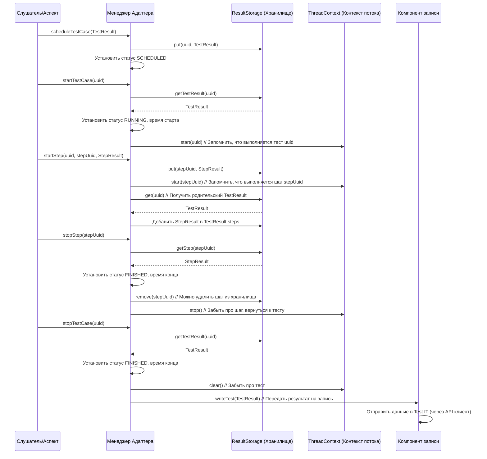

# Chapter 6: Менеджер Адаптера


В [предыдущей главе "Парсеры Сценариев/Тегов (Cucumber/JBehave)"](05_парсеры_сценариев_тегов__cucumber_jbehave__.md) мы разобрались, как адаптер извлекает важную информацию (метаданные) из текстовых BDD-сценариев с помощью парсеров тегов. А еще раньше мы узнали, как [Слушатели событий фреймворков](04_слушатели_событий_фреймворков_.md) собирают данные о ходе выполнения тестов и упаковывают их в [Модели Результатов Тестирования](03_модели_результатов_тестирования_.md).

Теперь у нас есть все нужные данные, но кто управляет всем этим процессом? Кто говорит, когда начинать отслеживание тестов, кому передавать собранные результаты и когда отправлять их в Test IT?

За эту координацию отвечает центральный компонент — **Менеджер Адаптера (`AdapterManager`)**.

## Оркестр Интеграции: Что делает Менеджер Адаптера?

Представьте себе дирижера оркестра. Музыканты (слушатели, парсеры) играют на своих инструментах (собирают данные), у них есть ноты (модели результатов). Но именно дирижер задает темп, указывает, кому и когда вступать, и следит за тем, чтобы все звучало гармонично, создавая цельное произведение (отчет в Test IT).

**Менеджер Адаптера** — это и есть такой дирижер для интеграции ваших тестов с Test IT. Он решает следующие задачи:

1.  **Запуск и Остановка "Концерта":** Если нужно, он может создать новый **тест-ран (Test Run)** в Test IT перед началом выполнения тестов и отметить его как завершенный после окончания всех тестов. Это зависит от [Конфигурации Адаптера](01_конфигурация_адаптера_.md) (параметр `adapterMode`).
2.  **Управление "Партиями" (Тестами и Шагами):** Он принимает сигналы от [Слушателей событий фреймворков](04_слушатели_событий_фреймворков_.md) и аспектов (`@Step`) о начале и конце каждого теста (`startTestCase`, `stopTestCase`) и каждого шага (`startStep`, `stopStep`).
3.  **Хранение "Нот" (Результатов):** Он использует временное хранилище (`ResultStorage`) для накопления и обновления информации о тестах и шагах ([Модели Результатов Тестирования](03_модели_результатов_тестирования_.md)) по мере их выполнения.
4.  **Передача "Партитуры" (Отправка Данных):** Когда тест или группа тестов завершаются, менеджер передает готовые "ноты" (объекты `TestResult`) компоненту записи ([Клиент API и Запись Результатов](07_клиент_api_и_запись_результатов_.md)), который уже непосредственно отправляет их в Test IT.
5.  **Отслеживание "Солиста" (Текущий Контекст):** Он следит, какой именно тест или шаг выполняется *в данный момент в конкретном потоке* (`ThreadContext`). Это важно, чтобы шаги, вложения или ссылки, добавляемые во время выполнения, привязались к правильному "солисту".

Вам, как пользователю, обычно не нужно напрямую вызывать методы `AdapterManager`. С ним взаимодействуют другие части адаптера (слушатели, аспект `@Step`, утилиты). Но понимание его роли помогает увидеть общую картину интеграции.

## Как компоненты общаются с Менеджером?

[Слушатели событий фреймворков](04_слушатели_событий_фреймворков_.md) и аспект `@Step` используют `AdapterManager` примерно так:

*   **Перед началом теста:**
    *   Слушатель создает `TestResult` с начальными данными (имя, External ID из аннотаций/тегов).
    *   Вызывает `adapterManager.scheduleTestCase(testResult)`: "Запланируй этот тест".
    *   Вызывает `adapterManager.startTestCase(uuid)`: "Начинаем выполнять тест с этим ID".
*   **Во время выполнения шага `@Step`:**
    *   Аспект создает `StepResult`.
    *   Вызывает `adapterManager.startStep(parentUuid, stepUuid, stepResult)`: "Внутри теста (parentUuid) начался шаг (stepUuid)".
    *   Аспект обновляет статус шага: `adapterManager.updateStep(stepUuid, ...)`.
    *   Вызывает `adapterManager.stopStep(stepUuid)`: "Шаг завершен".
*   **Во время добавления данных (например, ссылки или вложения):**
    *   Утилита `Adapter.addLinks(...)` или `Adapter.addAttachments(...)` получает текущий UUID теста/шага от `AdapterManager` (через `ThreadContext`).
    *   Вызывает `adapterManager.updateTestCase(...)` или `adapterManager.updateStep(...)`, добавляя ссылку/вложение к соответствующему объекту в `ResultStorage`.
*   **После завершения теста:**
    *   Слушатель обновляет финальный статус `TestResult`: `adapterManager.updateTestCase(uuid, ...)`.
    *   Вызывает `adapterManager.stopTestCase(uuid)`: "Тест завершен". Менеджер передаст этот `TestResult` на запись.

## Заглянем внутрь: Как устроен Менеджер

### Общая схема работы

Вот упрощенная схема, показывающая, как `AdapterManager` координирует процесс во время выполнения одного теста с одним шагом:



### Ключевые классы и компоненты

*   **`AdapterManager` (`ru.testit.services.AdapterManager`)**: Основной класс-координатор.
*   **`Adapter` (`ru.testit.services.Adapter`)**: Фабрика (или статический класс-держатель) для получения единственного экземпляра `AdapterManager` (`Adapter.getAdapterManager()`). Также предоставляет удобные статические методы для добавления данных к текущему тесту (`Adapter.addLinks`, `Adapter.addAttachments`).
*   **`ClientConfiguration`, `AdapterConfig`**: Объекты [Конфигурации Адаптера](01_конфигурация_адаптера_.md), которые передаются в `AdapterManager` при его создании. Они определяют, как адаптер должен работать (режим, URL, токен и т.д.).
*   **`ThreadContext` (`ru.testit.services.ThreadContext`)**: Вспомогательный класс, использующий `ThreadLocal` для хранения стека UUID выполняемых в данный момент тестов/шагов/фикстур для каждого потока. Помогает понять, к какому результату относятся добавляемые данные (`addAttachments`, `@Step` внутри `@Step`).
*   **`ResultStorage` (`ru.testit.services.ResultStorage`)**: Простое хранилище в памяти (обычно `ConcurrentHashMap`), где `AdapterManager` держит объекты `TestResult`, `StepResult`, `FixtureResult` по их UUID во время их выполнения и обновления.
*   **`Writer` (`ru.testit.writers.Writer`)**: Интерфейс, отвечающий за отправку результатов. `AdapterManager` использует конкретную реализацию (например, `HttpWriter`), чтобы передать готовые `TestResult`.
*   **`ApiClient` (`ru.testit.clients.ApiClient`)**: Клиент для взаимодействия с API Test IT. Используется `AdapterManager` для старта/остановки тест-рана и `Writer`-ом для отправки результатов.

### Пример кода `AdapterManager` (Упрощенно)

Давайте посмотрим на упрощенные фрагменты `AdapterManager.java`.

```java
package ru.testit.services;

// ... импорты ...
import ru.testit.clients.ApiClient;
import ru.testit.clients.ClientConfiguration;
import ru.testit.models.TestResult; // Модель результата
import ru.testit.models.StepResult; // Модель шага
import ru.testit.models.ItemStage; // Стадии: RUNNING, FINISHED...
import ru.testit.properties.AdapterConfig; // Конфигурация адаптера
import ru.testit.writers.Writer; // Интерфейс записи
import ru.testit.writers.HttpWriter; // Реализация записи по HTTP
import java.util.Optional;
import java.util.function.Consumer;

public class AdapterManager {
    private static final Logger LOGGER = LoggerFactory.getLogger(AdapterManager.class);

    // ---- Внутренние компоненты ----
    private final ThreadContext threadContext; // Хранит UUID текущего теста/шага для потока
    private final ResultStorage storage;       // Хранит TestResult/StepResult в памяти по UUID
    private final Writer writer;             // Отправляет результаты (например, через HTTP)
    private final ApiClient client;            // Клиент к API Test IT
    private final ClientConfiguration clientConfiguration; // Настройки подключения
    private final AdapterConfig adapterConfig; // Настройки поведения адаптера

    // ---- Конструктор ----
    public AdapterManager(ClientConfiguration clientConfiguration, AdapterConfig adapterConfig) {
        // ... (проверка конфигураций) ...
        this.clientConfiguration = clientConfiguration;
        this.adapterConfig = adapterConfig;
        this.storage = Adapter.getResultStorage(); // Получаем хранилище
        this.threadContext = new ThreadContext();  // Создаем контекст потока
        this.client = new TmsApiClient(this.clientConfiguration); // Создаем API клиент
        // Создаем компонент записи (Writer), передаем ему настройки, клиент и хранилище
        this.writer = new HttpWriter(this.clientConfiguration, this.client, this.storage);
        // ... (инициализация менеджера слушателей) ...
    }

    // ---- Управление Тест-раном ----
    public void startTests() {
        // Если интеграция выключена в конфиге, ничего не делаем
        if (!adapterConfig.shouldEnableTmsIntegration()) return;
        LOGGER.debug("Старт запуска тестов");

        // Синхронизируемся, чтобы избежать гонок при создании тест-рана
        synchronized (this.clientConfiguration) {
            // Если ID тест-рана уже задан, значит, используем существующий
            if (!Objects.equals(this.clientConfiguration.getTestRunId(), "null")) {
                LOGGER.debug("Тест-ран уже существует.");
                return;
            }
            // Если ID не задан, создаем новый тест-ран через API клиент
            try {
                TestRunV2ApiResult response = this.client.createTestRun();
                // Сохраняем полученный ID в конфигурацию для дальнейшего использования
                this.clientConfiguration.setTestRunId(response.getId().toString());
            } catch (ApiException e) {
                LOGGER.error("Не удалось начать запуск: {}", e.getMessage());
            }
        }
    }

    public void stopTests() {
        if (!adapterConfig.shouldEnableTmsIntegration()) return;
        LOGGER.debug("Остановка запуска тестов");
        try {
            // Получаем информацию о тест-ране
            TestRunV2ApiResult testRun = this.client.getTestRun(this.clientConfiguration.getTestRunId());
            // Если он еще не завершен, завершаем его через API
            if (testRun.getStateName() != TestRunState.COMPLETED) {
                this.client.completeTestRun(this.clientConfiguration.getTestRunId());
            }
        } catch (ApiException e) {
            // ... (обработка ошибок) ...
            LOGGER.error("Не удалось завершить запуск: {}", e.getMessage());
        }
    }

    // ---- Управление Тест-кейсом ----
    public void scheduleTestCase(final TestResult result) {
        if (!adapterConfig.shouldEnableTmsIntegration()) return;
        // Устанавливаем начальный статус "Запланирован"
        result.setItemStage(ItemStage.SCHEDULED);
        // Помещаем объект TestResult в хранилище по его UUID
        storage.put(result.getUuid(), result);
        LOGGER.debug("Тест-кейс запланирован: {}", result);
    }

    public void startTestCase(final String uuid) {
        if (!adapterConfig.shouldEnableTmsIntegration()) return;
        threadContext.clear(); // Очищаем контекст потока перед началом нового теста

        // Находим TestResult в хранилище
        final Optional<TestResult> found = storage.getTestResult(uuid);
        if (!found.isPresent()) { /* ... обработка ошибки ... */ return; }
        final TestResult testResult = found.get();

        // Обновляем статус на "Выполняется" и время старта
        testResult.setItemStage(ItemStage.RUNNING)
                  .setStart(System.currentTimeMillis());

        // Запоминаем UUID этого теста как текущий в контексте потока
        threadContext.start(uuid);
        LOGGER.debug("Тест-кейс начат: {}", testResult);
    }

    // Обновление данных ТЕКУЩЕГО тест-кейса (вызывается из Adapter.addLinks и т.д.)
    public void updateTestCase(final Consumer<TestResult> update) {
        if (!adapterConfig.shouldEnableTmsIntegration()) return;
        // Получаем UUID текущего выполняемого теста из контекста потока
        final Optional<String> root = threadContext.getRoot();
        if (!root.isPresent()) { /* ... обработка ошибки ... */ return; }
        // Вызываем обновление для найденного UUID
        updateTestCase(root.get(), update);
    }

    // Обновление данных тест-кейса по его UUID
    public void updateTestCase(final String uuid, final Consumer<TestResult> update) {
        if (!adapterConfig.shouldEnableTmsIntegration()) return;
        final Optional<TestResult> found = storage.getTestResult(uuid);
        if (!found.isPresent()) { /* ... обработка ошибки ... */ return; }
        // Применяем переданную функцию обновления к объекту TestResult
        update.accept(found.get());
        LOGGER.debug("Тест-кейс обновлен: {}", uuid);
    }

    public void stopTestCase(final String uuid) {
        if (!adapterConfig.shouldEnableTmsIntegration()) return;
        final Optional<TestResult> found = storage.getTestResult(uuid);
        if (!found.isPresent()) { /* ... обработка ошибки ... */ return; }
        final TestResult testResult = found.get();

        // ... (вызов лисенеров перед остановкой) ...

        // Устанавливаем статус "Завершен" и время окончания
        testResult.setItemStage(ItemStage.FINISHED)
                  .setStop(System.currentTimeMillis());

        // Очищаем контекст потока
        threadContext.clear();
        LOGGER.debug("Тест-кейс остановлен: {}", testResult);

        // <<< ВАЖНО: Передаем готовый TestResult компоненту Writer для отправки >>>
        writer.writeTest(testResult);
    }

    // ---- Управление Шагами (@Step) ----
    // (Методы startStep, updateStep, stopStep работают по аналогии с TestCase,
    //  но используют StepResult и управляют UUID шагов в ThreadContext)

    // Пример startStep
    public void startStep(final String parentUuid, final String uuid, final StepResult result) {
        if (!adapterConfig.shouldEnableTmsIntegration()) return;
        result.setItemStage(ItemStage.RUNNING).setStart(System.currentTimeMillis());
        // Добавляем шаг в хранилище
        storage.put(uuid, result);
        // Запоминаем UUID шага в контексте потока
        threadContext.start(uuid);
        // Находим родительский тест или шаг и добавляем этот шаг в его список дочерних шагов
        storage.get(parentUuid, ResultWithSteps.class).ifPresent(parentStep -> {
            synchronized (storage) {
                parentStep.getSteps().add(result);
            }
        });
        LOGGER.debug("Шаг начат: {} для родителя {}", result, parentUuid);
    }

    // Пример stopStep
    public void stopStep(final String uuid) {
        if (!adapterConfig.shouldEnableTmsIntegration()) return;
        final Optional<StepResult> found = storage.getStep(uuid);
        if (!found.isPresent()) { /* ... обработка ошибки ... */ return; }
        final StepResult step = found.get();
        step.setItemStage(ItemStage.FINISHED).setStop(System.currentTimeMillis());
        // Удаляем шаг из хранилища (уже не нужен)
        storage.remove(uuid);
        // Удаляем UUID шага из контекста потока
        threadContext.stop();
        LOGGER.debug("Шаг остановлен: {}", step);
    }

    // ---- Добавление Вложений ----
    public void addAttachments(List<String> attachments) {
        if (!adapterConfig.shouldEnableTmsIntegration()) return;
        List<String> uuids = new ArrayList<>();
        // Сначала отправляем каждый файл через Writer и получаем их ID в Test IT
        for (final String attachmentPath : attachments) {
            String attachmentId = writer.writeAttachment(attachmentPath); // Отправка файла
            if (!attachmentId.isEmpty()) {
                uuids.add(attachmentId); // Собираем ID загруженных файлов
            }
        }
        // Получаем UUID текущего теста или шага из контекста потока
        final Optional<String> current = threadContext.getCurrent();
        if (!current.isPresent()) { /* ... обработка ошибки ... */ return; }
        // Находим объект TestResult/StepResult/FixtureResult и добавляем ID вложений
        storage.get(current.get(), ResultWithAttachments.class).ifPresent(
            result -> {
                synchronized (storage) {
                    result.getAttachments().addAll(uuids);
                }
            }
        );
    }

    // ... (другие методы: управление фикстурами, получение тестов для фильтрации) ...
}
```

Обратите внимание, как `AdapterManager` постоянно взаимодействует с `storage` (для хранения данных), `threadContext` (для понимания текущего контекста) и `writer` (для отправки завершенных результатов).

---

Теперь посмотрим, как мы обычно получаем доступ к `AdapterManager` с помощью класса `Adapter`:

```java
package ru.testit.services;

// ... импорты ...

public final class Adapter {
    private static AdapterManager adapterManager; // Хранит единственный экземпляр менеджера
    private static ResultStorage storage; // Хранит хранилище (тоже обычно одно)

    // Метод для получения экземпляра менеджера
    public static AdapterManager getAdapterManager() {
        // Ленивая инициализация: создаем менеджер только при первом обращении
        if (Objects.isNull(adapterManager)) {
            // 1. Загружаем конфигурацию
            Properties appProperties = AppProperties.loadProperties();
            // 2. Создаем менеджер конфигураций
            ConfigManager configManager = new ConfigManager(appProperties);
            // 3. Создаем AdapterManager, передавая ему конфигурации
            adapterManager = new AdapterManager(
                configManager.getClientConfiguration(),
                configManager.getAdapterConfig()
            );
        }
        return adapterManager;
    }

    // Метод для получения хранилища
    public static ResultStorage getResultStorage() {
        if (Objects.isNull(storage)) {
            storage = new ResultStorage();
        }
        return storage;
    }

    // ---- Вспомогательные статические методы ----
    // (Вызываются пользователем или утилитами для добавления данных к ТЕКУЩЕМУ тесту/шагу)

    // Добавить ссылки
    public static void addLinks(List<LinkItem> links) {
        // Получаем менеджер и вызываем его метод updateTestCase,
        // который сам найдет текущий тест и добавит ссылки
        getAdapterManager().updateTestCase(testResult -> testResult.getResultLinks().addAll(links));
    }

    // Добавить вложения по именам файлов
    public static void addAttachments(List<String> attachments) {
        // Получаем менеджер и вызываем его метод addAttachments
        getAdapterManager().addAttachments(attachments);
    }

    // Добавить текстовое сообщение
    public static void addMessage(String message) {
        getAdapterManager().updateTestCase(testResult -> testResult.setMessage(message));
    }

    // ... (другие вспомогательные методы, в т.ч. @Deprecated) ...
}
```

Именно через `Adapter.getAdapterManager()` слушатели и аспекты получают доступ к центральному координатору. А методы типа `Adapter.addLinks` предоставляют удобный способ добавить данные к тесту, не задумываясь о том, какой именно тест сейчас выполняется - об этом позаботится `AdapterManager` с помощью `ThreadContext`.

## Заключение

**Менеджер Адаптера (`AdapterManager`)** — это сердце `adapters-java`, дирижер всего процесса интеграции. Он запускает и останавливает тест-раны (если нужно), управляет жизненным циклом тестов и шагов, координирует сбор данных в `ResultStorage`, отслеживает контекст выполнения с помощью `ThreadContext` и, самое главное, передает готовые результаты компоненту `Writer` для отправки в Test IT.

Хотя он работает "за кулисами", понимание его роли и взаимодействия с другими компонентами ([Слушателями](04_слушатели_событий_фреймворков_.md), [Моделями](03_модели_результатов_тестирования_.md), [Конфигурацией](01_конфигурация_адаптера_.md)) помогает составить полную картину работы адаптера.

В следующей главе мы подробнее рассмотрим компоненты, отвечающие за финальный этап — непосредственную отправку данных в Test IT: [Клиент API и Запись Результатов](07_клиент_api_и_запись_результатов_.md).

**Следующая глава:** [Клиент API и Запись Результатов](07_клиент_api_и_запись_результатов_.md)

---

Generated by [AI Codebase Knowledge Builder](https://github.com/The-Pocket/Tutorial-Codebase-Knowledge)