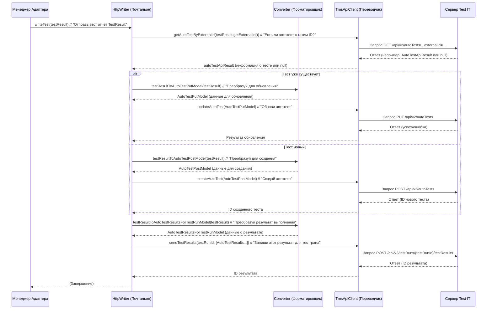

# Chapter 7: Клиент API и Запись Результатов


В [предыдущей главе "Менеджер Адаптера"](06_менеджер_адаптера_.md) мы увидели, как `AdapterManager` выступает в роли дирижера, координируя сбор данных о результатах тестов, которые собирают [Слушатели событий фреймворков](04_слушатели_событий_фреймворков_.md) и упаковывают в [Модели Результатов Тестирования](03_модели_результатов_тестирования_.md). Менеджер знает, когда тест начался, когда закончился, и хранит всю информацию ([`TestResult`](03_модели_результатов_тестирования_.md)) в `ResultStorage`.

Но как эта информация попадает из нашего проекта на сервер Test IT? Представьте: у нас есть готовый и упакованный отчет о тесте (объект `TestResult`), но его нужно как-то доставить по адресу (наш сервер Test IT) и вручить кому-то, кто понимает его содержимое (API Test IT).

Именно для этой финальной стадии — доставки информации — и существуют компоненты **Клиент API (`ApiClient`)** и **Запись Результатов (`Writer`)**.

## Задача: Отправить отчет в Test IT

Давайте вернемся к нашей аналогии с почтой.
*   [Модели Результатов Тестирования](03_модели_результатов_тестирования_.md) - это отчеты о проделанной работе (результатах тестов).
*   [Менеджер Адаптера](06_менеджер_адаптера_.md) - начальник отдела, который собирает эти отчеты.

Теперь нам нужны:
1.  **Почтальон (`Writer`):** Тот, кто возьмет готовый отчет (`TestResult`), положит его в правильный конверт (отформатирует данные) и отнесет на почту (отправит на сервер).
2.  **Словарь/Переводчик (`ApiClient`):** На почте (сервер Test IT) говорят на особом языке (API). Нам нужен кто-то, кто знает этот язык и сможет объяснить, что мы принесли и куда это положить (какие методы API вызвать, с какими параметрами).

Компоненты "Клиент API и Запись Результатов" решают именно эту задачу: они берут подготовленные `TestResult` и обеспечивают их передачу на сервер Test IT понятным для сервера способом.

## Ключевые участники доставки

### 1. `ApiClient` (Словарь/Переводчик с языка Test IT)

**Интерфейс:** `ru.testit.clients.ApiClient`
**Основная реализация:** `ru.testit.clients.TmsApiClient`

`ApiClient` — это компонент, который "знает", как общаться с API сервера Test IT. Он предоставляет Java-методы, которые соответствуют различным действиям в Test IT:

*   Создать новый тест-ран (`createTestRun`)
*   Получить информацию о тест-ране (`getTestRun`)
*   Завершить тест-ран (`completeTestRun`)
*   Создать автотест (`createAutoTest`)
*   Обновить автотест (`updateAutoTest`)
*   Найти автотест по External ID (`getAutoTestByExternalId`)
*   Отправить результаты тестов (`sendTestResults`)
*   Загрузить файл (вложение) (`addAttachment`)
*   Связать автотест с Work Item (`linkAutoTestToWorkItems`)

По сути, `ApiClient` — это ваш программный интерфейс для взаимодействия с Test IT. Он берет на себя всю сложность формирования HTTP-запросов, добавления заголовков аутентификации (приватного токена из [Конфигурация Адаптера](01_конфигурация_адаптера_.md)) и обработки ответов сервера.

```java
// Пример интерфейса ApiClient (упрощенно)
// Файл: testit-java-commons/src/main/java/ru/testit/clients/ApiClient.java
package ru.testit.clients;

import ru.testit.client.invoker.ApiException;
import ru.testit.client.model.*; // Модели, понятные API Test IT
import java.util.List;
import java.util.UUID;

public interface ApiClient {
    // Создать тест-ран
    TestRunV2ApiResult createTestRun() throws ApiException;

    // Найти тест по External ID
    AutoTestApiResult getAutoTestByExternalId(String externalId) throws ApiException;

    // Создать новый автотест
    String createAutoTest(AutoTestPostModel model) throws ApiException;

    // Обновить существующий автотест
    void updateAutoTest(AutoTestPutModel model) throws ApiException;

    // Отправить результаты для тест-рана
    List<UUID> sendTestResults(String testRunUuid, List<AutoTestResultsForTestRunModel> models) throws ApiException;

    // Загрузить вложение
    String addAttachment(String path) throws ApiException;

    // ... другие методы API ...
}
```
Реализация `TmsApiClient` содержит всю логику для вызова этих методов через HTTP, используя библиотеки для работы с REST API.

### 2. `Writer` (Почтальон)

**Интерфейс:** `ru.testit.writers.Writer`
**Основная реализация:** `ru.testit.writers.HttpWriter`

`Writer` — это компонент, который непосредственно отвечает за процесс записи данных. Он получает от [Менеджер Адаптера](06_менеджер_адаптера_.md) готовый объект `TestResult`, когда тест завершается. Его задача — взять этот `TestResult`, возможно, отформатировать его (с помощью Конвертера, о котором ниже) и использовать `ApiClient` для отправки информации на сервер Test IT.

`HttpWriter` — это реализация, которая отправляет данные по HTTP. Он выполняет следующую последовательность действий (упрощенно) для каждого `TestResult`:

1.  Берет `externalId` из `TestResult`.
2.  Спрашивает у `ApiClient`: "Существует ли автотест с таким `externalId`?" (`getAutoTestByExternalId`).
3.  **Если нет:** Говорит `ApiClient`: "Создай новый автотест с этими данными" (`createAutoTest`).
4.  **Если да:** Говорит `ApiClient`: "Обнови существующий автотест с вот этими данными" (`updateAutoTest`).
5.  Если у теста есть `workItemIds`, говорит `ApiClient`: "Свяжи этот автотест с этими Work Items" (`linkAutoTestToWorkItems`).
6.  Говорит `ApiClient`: "Вот результат выполнения этого теста (статус, время, шаги, вложения), добавь его к текущему тест-рану" (`sendTestResults`).
7.  Если нужно загрузить вложения, вызывает `ApiClient.addAttachment` для каждого файла.

```java
// Пример интерфейса Writer (упрощенно)
// Файл: testit-java-commons/src/main/java/ru/testit/writers/Writer.java
package ru.testit.writers;

import ru.testit.models.TestResult; // Наша внутренняя модель
// ... другие импорты ...

public interface Writer {
    // Записать результат одного теста
    void writeTest(TestResult testResult);

    // Загрузить файл как вложение
    String writeAttachment(String path);

    // Методы для пакетной записи (менее важны для понимания основ)
    // void writeClass(ClassContainer container);
    // void writeTests(MainContainer container);
}
```
`HttpWriter` реализует эти методы, используя `ApiClient` для реальной отправки данных.

### 3. `Converter` (Помощник Почтальона - Форматировщик)

**Класс:** `ru.testit.writers.Converter`

Мы столкнулись с небольшой деталью: формат данных, в котором адаптер хранит результаты ([Модели Результатов Тестирования](03_модели_результатов_тестирования_.md), например `TestResult`, `StepResult`), не полностью совпадает с форматом, который ожидает API Test IT (модели из `ru.testit.client.model`, например `AutoTestPostModel`, `AutoTestResultsForTestRunModel`).

Класс `Converter` — это статический вспомогательный класс, который выполняет преобразование между нашими внутренними моделями и моделями, понятными для `ApiClient`.

Представьте, что `TestResult` — это ваш черновик отчета, а `AutoTestPostModel` — это официальный бланк, который принимает API. `Converter` заполняет этот бланк на основе вашего черновика.

```java
// Пример метода из Converter.java (упрощенно)
// Файл: testit-java-commons/src/main/java/ru/testit/writers/Converter.java
package ru.testit.writers;

import ru.testit.client.model.*; // Модели API
import ru.testit.models.TestResult; // Наша модель

public class Converter {

    // Преобразует наш TestResult в модель для создания нового автотеста
    public static AutoTestPostModel testResultToAutoTestPostModel(TestResult result) {
        AutoTestPostModel model = new AutoTestPostModel(); // Создаем "официальный бланк"

        // Переносим данные из нашего "черновика" (result) в "бланк" (model)
        model.setExternalId(result.getExternalId());
        model.setName(result.getName());
        model.setTitle(result.getTitle());
        model.setDescription(result.getDescription());
        model.setSteps(convertSteps(result.getSteps())); // Преобразуем шаги рекурсивно
        model.setLabels(labelsPostConvert(result.getLabels())); // Преобразуем метки
        model.setLinks(convertPostLinks(result.getLinkItems())); // Преобразуем ссылки
        // ... и другие поля ...

        return model; // Возвращаем заполненный "бланк"
    }

    // Преобразует наш TestResult в модель для отправки результата выполнения
    public static AutoTestResultsForTestRunModel testResultToAutoTestResultsForTestRunModel(TestResult result) {
        AutoTestResultsForTestRunModel model = new AutoTestResultsForTestRunModel();

        model.setAutoTestExternalId(result.getExternalId()); // Ссылка на автотест
        model.setOutcome(AvailableTestResultOutcome.fromValue(result.getItemStatus().value())); // Статус: Passed, Failed...
        model.setStartedOn(dateToOffsetDateTime(result.getStart())); // Время начала
        model.setCompletedOn(dateToOffsetDateTime(result.getStop())); // Время конца
        model.setDuration(result.getStop() - result.getStart()); // Длительность
        model.setStepResults(convertResultStep(result.getSteps())); // Результаты шагов
        model.attachments(convertAttachments(result.getAttachments())); // Вложения
        model.setMessage(result.getMessage()); // Сообщение (или ошибка)
        // ... и другие поля ...

        return model;
    }

    // ... другие методы конвертации (для шагов, ссылок, дат и т.д.) ...
    // private static List<AutoTestStepModel> convertSteps(...) { ... }
    // private static OffsetDateTime dateToOffsetDateTime(...) { ... }
    // ...
}
```
`Writer` (например, `HttpWriter`) использует эти методы `Converter`, чтобы подготовить данные перед вызовом методов `ApiClient`.

## Общая картина: Как данные доходят до Test IT

Вот как эти компоненты работают вместе, когда тест завершается:


**В итоге:** `AdapterManager` вызывает `Writer`, `Writer` использует `Converter` для форматирования данных и `ApiClient` для фактической отправки этих данных на сервер Test IT. Пользователю адаптера не нужно напрямую работать с этими компонентами, но их взаимодействие обеспечивает доставку результатов.

## Заглянем глубже (Примеры кода)

### `TmsApiClient`: Отправка запроса

Вот как `TmsApiClient` может вызывать метод API для отправки результатов, используя сгенерированный клиент (`TestRunsApi`):

```java
// Упрощенный фрагмент из TmsApiClient.java
package ru.testit.clients;

import ru.testit.client.api.TestRunsApi; // Сгенерированный клиент для API тест-ранов
import ru.testit.client.invoker.ApiException;
import ru.testit.client.model.*; // Модели, генерируемые из спецификации API
import java.util.List;
import java.util.UUID;
// ... другие импорты ...

public class TmsApiClient implements ApiClient {
    private final TestRunsApi testRunsApi; // Объект для вызова API тест-ранов
    private final ClientConfiguration clientConfiguration; // Настройки

    public TmsApiClient(ClientConfiguration config) {
        // ... (Настройка базового API клиента: URL, токен из config) ...
        ru.testit.client.invoker.ApiClient apiClient = new ru.testit.client.invoker.ApiClient();
        apiClient.setBasePath(config.getUrl());
        apiClient.setApiKeyPrefix("PrivateToken");
        apiClient.setApiKey(config.getPrivateToken());
        // ...

        this.testRunsApi = new TestRunsApi(apiClient); // Инициализация API-клиента для тест-ранов
        this.clientConfiguration = config;
        // ... (инициализация других API клиентов: AutoTestsApi, AttachmentsApi...)
    }

    // Отправка результатов
    @Override
    public List<UUID> sendTestResults(String testRunUuid, List<AutoTestResultsForTestRunModel> models) throws ApiException {
        // Просто вызываем соответствующий метод сгенерированного клиента TestRunsApi
        // Передаем ID тест-рана (из конфигурации) и список отформатированных результатов (models)
        return testRunsApi.setAutoTestResultsForTestRun(UUID.fromString(testRunUuid), models);
        // Этот вызов внутри testRunsApi сформирует нужный HTTP POST запрос
        // к /api/v2/testRuns/{testRunUuid}/testResults
    }

    // ... другие методы ApiClient, вызывающие соответствующие методы AutoTestsApi, AttachmentsApi и т.д. ...
}
```

### `HttpWriter`: Оркестровка записи

А вот как `HttpWriter` использует `ApiClient` и `Converter` для записи одного теста:

```java
// Упрощенный фрагмент из HttpWriter.java
package ru.testit.writers;

import ru.testit.client.invoker.ApiException;
import ru.testit.client.model.*;
import ru.testit.clients.ApiClient; // Наш интерфейс API клиента
import ru.testit.models.TestResult; // Наша внутренняя модель
// ... другие импорты ...

public class HttpWriter implements Writer {
    // ... логгер, хранилище локальных результатов ...
    private final ApiClient apiClient; // "Переводчик"
    private final ClientConfiguration config; // Настройки (URL, Project ID, TestRun ID...)

    public HttpWriter(ClientConfiguration config, ApiClient client, /*...*/) {
        this.config = config;
        this.apiClient = client;
        // ...
    }

    // Основной метод записи одного теста
    @Override
    public void writeTest(TestResult testResult) {
        // Проверяем режим работы (надо ли отправлять сразу?)
        if (!config.shouldImportRealtime()) { return; }

        try {
            // 1. Пытаемся найти существующий автотест по External ID
            AutoTestApiResult autoTestApiResult = apiClient.getAutoTestByExternalId(testResult.getExternalId());
            String autoTestId; // ID автотеста в Test Tt

            // 2. Конвертируем найденный результат API в нашу модель (если он есть)
            AutoTestModel existingAutotest = Converter.convertAutoTestApiResultToAutoTestModel(autoTestApiResult);

            if (existingAutotest != null) {
                // 3а. Если автотест есть - готовим модель для ОБНОВЛЕНИЯ
                AutoTestPutModel autoTestPutModel = prepareToUpdateAutoTest(testResult, existingAutotest);
                // Обновляем автотест через API клиент
                apiClient.updateAutoTest(autoTestPutModel);
                autoTestId = existingAutotest.getId().toString();
            } else {
                // 3б. Если автотеста нет - готовим модель для СОЗДАНИЯ
                AutoTestPostModel model = prepareToCreateAutoTest(testResult);
                // Создаем автотест через API клиент
                autoTestId = apiClient.createAutoTest(model);
            }

            // 4. Если нужно, обновляем связи с Work Items
            if (!testResult.getWorkItemIds().isEmpty()) {
                updateTestLinkToWorkItems(autoTestId, testResult.getWorkItemIds());
            }

            // 5. Готовим модель РЕЗУЛЬТАТА выполнения теста
            AutoTestResultsForTestRunModel testRunResultModel = prepareTestResultForTestRun(testResult);

            // 6. Отправляем результат выполнения теста через API клиент
            List<AutoTestResultsForTestRunModel> results = Collections.singletonList(testRunResultModel);
            apiClient.sendTestResults(config.getTestRunId(), results);
            // ... (сохраняем ID результата локально, если нужно) ...

        } catch (ApiException e) {
            LOGGER.error("Не удалось записать автотест: {}", e.getMessage());
        }
    }

    // Вспомогательный метод: использует Converter для создания модели AutoTestPostModel
    private AutoTestPostModel prepareToCreateAutoTest(TestResult testResult) throws ApiException {
        AutoTestPostModel model = Converter.testResultToAutoTestPostModel(testResult);
        model.setProjectId(UUID.fromString(config.getProjectId()));
        // ... (возможно, получаем UUID для Work Items через apiClient) ...
        return model;
    }

    // Вспомогательный метод: использует Converter для создания модели AutoTestPutModel
    private AutoTestPutModel prepareToUpdateAutoTest(TestResult testResult, AutoTestModel autotest) throws ApiException {
        AutoTestPutModel model = Converter.testResultToAutoTestPutModel(testResult);
        model.setProjectId(UUID.fromString(config.getProjectId()));
        // ... (логика объединения ссылок, установка флага isFlaky и т.д.) ...
        // ... (возможно, получаем UUID для Work Items) ...
        return model;
    }

    // Вспомогательный метод: использует Converter для создания модели AutoTestResultsForTestRunModel
    private AutoTestResultsForTestRunModel prepareTestResultForTestRun(TestResult testResult) {
        AutoTestResultsForTestRunModel model = Converter.testResultToAutoTestResultsForTestRunModel(testResult);
        model.setConfigurationId(UUID.fromString(config.getConfigurationId()));
        return model;
    }

    // Вспомогательный метод: вызывает методы apiClient для связывания с Work Items
    private void updateTestLinkToWorkItems(String autoTestId, List<String> workItemIds) throws ApiException {
        // ... (логика проверки существующих связей и вызов apiClient.linkAutoTestToWorkItems) ...
        apiClient.linkAutoTestToWorkItems(autoTestId, workItemIds);
    }

    // Метод для записи вложения
    @Override
    public String writeAttachment(String path) {
        try {
            // Просто вызываем метод API клиента
            return apiClient.addAttachment(path);
        } catch (ApiException e) {
            // ... (обработка ошибок) ...
            return "";
        }
    }

    // ... другие методы ...
}

```
Как видите, `HttpWriter` — это дирижер процесса записи, активно использующий `Converter` для подготовки данных и `ApiClient` для их отправки.

## Заключение

Компоненты "Клиент API и Запись Результатов" — это финальное звено в цепочке интеграции с Test IT.

*   **`ApiClient`** (`TmsApiClient`) — это наш словарь и переводчик, знающий язык API Test IT.
*   **`Converter`** — это помощник, который форматирует наши внутренние отчеты (`TestResult`) в формат, понятный API.
*   **`Writer`** (`HttpWriter`) — это почтальон, который берет отчет, использует `Converter` для форматирования и `ApiClient` для отправки его на сервер Test IT.

Вместе они обеспечивают, что все данные, собранные адаптером во время выполнения тестов, будут успешно доставлены и записаны в вашу систему Test IT.

Теперь, когда мы рассмотрели все основные компоненты адаптера, в последней главе мы взглянем на различные вспомогательные инструменты и классы, которые облегчают работу с адаптером и предоставляют дополнительные удобства.

**Следующая глава:** [Утилиты](08_утилиты_.md)

---

Generated by [AI Codebase Knowledge Builder](https://github.com/The-Pocket/Tutorial-Codebase-Knowledge)