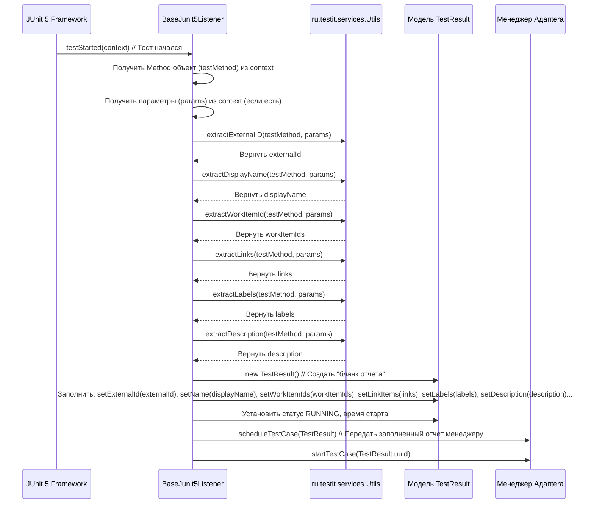

# Chapter 8: Утилиты


Добро пожаловать в заключительную главу нашего руководства по `adapters-java`! В [предыдущей главе "Клиент API и Запись Результатов"](07_клиент_api.md) мы узнали, как подготовленные данные о тестах (`TestResult`) отправляются на сервер Test IT с помощью `Writer` и `ApiClient`. Мы увидели весь путь данных: от их сбора [Слушателями](04_слушатели_событий_фреймворков_.md), упаковки в [Модели](03_модели_результатов_тестирования_.md), координации [Менеджером Адаптера](06_менеджер_адаптера_.md) до финальной отправки.

На протяжении всего этого процесса различные компоненты адаптера выполняют похожие вспомогательные задачи: извлечение информации из аннотаций, форматирование строк, создание уникальных идентификаторов и так далее. Чтобы не писать один и тот же код во многих местах, существует специальный набор инструментов — **Утилиты**.

## Ящик с инструментами: Зачем нужны Утилиты?

Представьте, что вы собираете сложный механизм. У вас есть основные детали (как наши главные компоненты адаптера), но вам постоянно нужны простые инструменты: отвертка, чтобы закрутить винт, ключ, чтобы затянуть гайку, линейка, чтобы что-то измерить. Было бы неудобно каждый раз создавать эти инструменты заново. Гораздо лучше иметь под рукой готовый ящик с инструментами.

**Утилиты** в `adapters-java` — это и есть такой "ящик с инструментами". Это набор статических методов (функций), собранных в одном месте (в основном, в классе `Utils`), которые выполняют часто используемые вспомогательные операции. Они нужны, чтобы:

1.  **Избежать Дублирования Кода:** Вместо того, чтобы каждый [Слушатель событий фреймворков](04_слушатели_событий_фреймворков_.md) (для JUnit 4, JUnit 5, TestNG) писал свой код для чтения аннотации `@ExternalId`, они все могут использовать один и тот же метод `Utils.extractExternalID`.
2.  **Упростить Основную Логику:** Основные компоненты (как слушатели или [Парсеры Сценариев/Тегов](05_парсеры_сценариев_тегов__cucumber_jbehave__.md)) становятся чище и понятнее, так как они делегируют рутинные задачи утилитам.
3.  **Централизовать Общие Операции:** Если нужно изменить логику какой-то вспомогательной операции (например, способ генерации хеша), достаточно изменить ее в одном месте — в утилитном классе.

Компонент "Утилиты" — это не самостоятельная большая часть адаптера, а скорее набор полезных функций, которые облегчают жизнь другим компонентам.

## Основные инструменты в "ящике"

Давайте посмотрим на некоторые важные "инструменты" (методы), которые предоставляются классом `Utils` (в основном это `ru.testit.services.Utils` из `testit-java-commons`).

### 1. Извлечение данных из Аннотаций

Это одна из самых частых задач. Утилиты помогают легко получить значения из [Аннотаций для Тестов](02_аннотации_для_тестов_.md).

*   **`Utils.extractExternalID(method, parameters)`:**
    *   Ищет аннотацию `@ExternalId` на переданном методе `method`.
    *   Если находит, возвращает ее значение (например, `"AUTH-001"`).
    *   Если аннотации нет, генерирует уникальный хеш на основе имени класса и метода (чтобы у каждого теста был хоть какой-то ID) с помощью `Utils.getHash()`.
    *   Подставляет значения `parameters` в строку, если она содержит плейсхолдеры вида `{paramName}`.

    ```java
    // Пример использования (внутри слушателя)
    Method testMethod = /* ... получаем Method объекта теста ... */;
    Map<String, String> params = /* ... параметры теста, если есть ... */;
    String externalId = Utils.extractExternalID(testMethod, params);
    // externalId будет содержать значение @ExternalId или сгенерированный хеш
    ```

*   **`Utils.extractDisplayName(method, parameters)`:**
    *   Работает аналогично, но ищет аннотацию `@DisplayName`.
    *   Если находит, возвращает ее значение.
    *   Если нет, возвращает имя самого метода `method` (Java-имя).
    *   Также поддерживает подстановку `parameters`.

    ```java
    // Пример использования
    String displayName = Utils.extractDisplayName(testMethod, params);
    // displayName будет содержать значение @DisplayName или имя метода
    ```

*   **`Utils.extractWorkItemId(method, parameters)`:** Извлекает список ID из `@WorkItemIds`.
*   **`Utils.extractLinks(method, parameters)`:** Извлекает список ссылок (`LinkItem`) из `@Link` или `@Links`.
*   **`Utils.extractLabels(method, parameters)`:** Извлекает список меток (`Label`) из `@Labels`.
*   **`Utils.extractDescription(method, parameters)`:** Извлекает текст из `@Description`.
*   **`Utils.extractTitle(method, parameters, isTestMethod)`:** Извлекает текст из `@Title`.
*   **`Utils.extractNamespace(method, defaultNamespace, parameters)`:** Ищет `@Namespace` на методе или классе.
*   **`Utils.extractClassname(method, defaultClassName, parameters)`:** Ищет `@Classname` на методе или классе.

**Как это работает внутри (упрощенно для `extractDisplayName`):**

```java
// Упрощенный фрагмент из ru.testit.services.Utils.java
package ru.testit.services;

import ru.testit.annotations.DisplayName;
import java.lang.reflect.Method;
import java.util.Map;

public class Utils {
    public static String extractDisplayName(final Method atomicTest, Map<String, String> parameters) {
        // 1. Ищем аннотацию @DisplayName на методе
        final DisplayName annotation = atomicTest.getAnnotation(DisplayName.class);

        // 2. Если аннотация найдена:
        if (annotation != null) {
            // Берем ее значение и подставляем параметры (если есть)
            return setParameters(annotation.value(), parameters);
        } else {
            // 3. Если аннотации нет:
            // Возвращаем просто имя метода
            return atomicTest.getName();
        }
    }

    // ... другие методы ...
    public static String setParameters(String value, Map<String, String> parameters) { /*...*/ }
}
```
Этот простой шаблон (проверить аннотацию -> вернуть значение или значение по умолчанию -> подставить параметры) используется для всех методов извлечения.

### 2. Генерация Хеша (`Utils.getHash`)

Если для теста не указан `@ExternalId`, адаптеру все равно нужен какой-то уникальный идентификатор для связи результатов с автотестом в Test IT. `Utils.getHash()` решает эту проблему.

```java
// Упрощенный фрагмент из ru.testit.services.Utils.java
package ru.testit.services;

import java.math.BigInteger;
import java.nio.charset.StandardCharsets;
import java.security.MessageDigest;
import java.security.NoSuchAlgorithmException;

public class Utils {
    public static String getHash(String value) {
        try {
            // Получаем реализацию алгоритма хеширования SHA-256
            MessageDigest md = MessageDigest.getInstance("SHA-256");
            // Передаем строку (например, "имя_класса" + "имя_метода") в байтах UTF-8
            md.update(value.getBytes(StandardCharsets.UTF_8));
            // Вычисляем хеш (массив байт)
            byte[] digest = md.digest();
            // Преобразуем байты в привычную шестнадцатеричную строку
            return convertToHex(digest);
        } catch (NoSuchAlgorithmException e) {
            // Если SHA-256 недоступен (очень маловероятно), возвращаем исходное значение
            return value;
        }
    }

    // Вспомогательный метод для конвертации байт в hex-строку
    private static String convertToHex(final byte[] messageDigest) {
        BigInteger bigint = new BigInteger(1, messageDigest);
        String hexText = bigint.toString(16);
        // Дополняем нулями слева до стандартной длины (для единообразия)
        while (hexText.length() < 32) {
            hexText = "0".concat(hexText);
        }
        return hexText.toUpperCase();
    }
    // ...
}
```
Таким образом, даже если вы забудете поставить `@ExternalId`, адаптер сгенерирует стабильный ID для вашего теста на основе его имени и имени класса.

### 3. Подстановка Параметров (`Utils.setParameters`)

Эта утилита очень важна для параметризованных тестов или когда вы хотите включать динамические данные в имена тестов, описания, ссылки и т.д. Она ищет в строке плейсхолдеры вида `{parameterName}` и заменяет их на значения из переданной карты `parameters`.

```java
// Упрощенный фрагмент из ru.testit.services.Utils.java
package ru.testit.services;

import java.util.Map;
import java.util.regex.Matcher;
import java.util.regex.Pattern;
import static java.util.Objects.isNull;

public class Utils {
    public static String setParameters(String value, Map<String, String> parameters) {
        // Если параметры или исходная строка отсутствуют, ничего не делаем
        if (!isNull(parameters) && !isNull(value)) {
            // Регулярное выражение для поиска "{paramName}" (с пробелами или без)
            Pattern pattern = Pattern.compile("\\{\\s*(\\w+)}");
            Matcher matcher = pattern.matcher(value);

            // Ищем все вхождения шаблона в строке
            while (matcher.find()) {
                String parameterName = matcher.group(1); // Извлекаем имя параметра (то, что внутри скобок)
                String parameterValue = parameters.get(parameterName); // Ищем значение в карте

                // Если значение для этого параметра найдено в карте
                if (!isNull(parameterValue)) {
                    // Заменяем "{paramName}" на найденное значение
                    value = value.replace(String.format("{%s}", parameterName), parameterValue);
                    // Пересоздаем Matcher для обновленной строки, чтобы найти следующие вхождения
                    matcher = pattern.matcher(value);
                }
            }
        }
        // Возвращаем строку с подставленными параметрами (или исходную, если ничего не нашлось)
        return value;
    }
    // ...
}
```

**Пример:**

```java
// Где-то в коде теста или аннотации
String template = "Проверка входа для пользователя {user} с паролем {password}";
Map<String, String> currentParams = new HashMap<>();
currentParams.put("user", "testuser");
currentParams.put("password", "qwerty");

// Утилита выполнит подстановку
String result = Utils.setParameters(template, currentParams);

// result будет содержать: "Проверка входа для пользователя testuser с паролем qwerty"
System.out.println(result);
```

### 4. Обработка URL (`Utils.urlTrim`)

Простая утилита для удаления косой черты (`/`) с конца URL, если она там есть. Это помогает избежать проблем при конкатенации URL и путей API.

```java
// Фрагмент из ru.testit.services.Utils.java
public static String urlTrim(String url) {
    if (url != null && url.endsWith("/")) {
        return url.substring(0, url.length() - 1); // Удаляем последний символ
    }
    return url; // Возвращаем как есть, если слеша нет или URL null
}
```

## Как Слушатели Используют Утилиты

Давайте посмотрим на упрощенный сценарий, как [Слушатель событий фреймворков](04_слушатели_событий_фреймворков_.md) (например, для JUnit 5) использует `Utils` при старте теста:



Как видите, слушатель просто вызывает нужные методы из `Utils`, передавая им информацию о методе теста и его параметрах, и получает обратно готовые данные для заполнения [Модели Результатов Тестирования](03_модели_результатов_тестирования_.md). Это делает код слушателя намного проще и чище.

## Заключение

Утилиты в `adapters-java` — это набор вспомогательных функций, своего рода "ящик с инструментами", который используется другими компонентами адаптера. Они централизуют и упрощают рутинные задачи, такие как:

*   Извлечение метаданных из [Аннотаций для Тестов](02_аннотации_для_тестов_.md) (External ID, DisplayName, Links, Labels и т.д.).
*   Генерация уникальных ID (хешей), если явный ID не указан.
*   Подстановка параметров в строки (для имен тестов, описаний, ссылок).
*   Простая обработка строк (например, URL).

Использование утилит делает код основных компонентов адаптера (таких как [Слушатели событий фреймворков](04_слушатели_событий_фреймворков_.md)) более лаконичным, понятным и легким в поддержке, так как общая логика вынесена в одно место.

---

На этом мы завершаем наше путешествие по основным компонентам `adapters-java`. Мы рассмотрели:

1.  [**Конфигурацию Адаптера**](01_конфигурация_адаптера_.md): Как настроить подключение и поведение.
2.  [**Аннотации для Тестов**](02_аннотации_для_тестов_.md): Как обогащать тесты метаданными.
3.  [**Модели Результатов Тестирования**](03_модели_результатов_тестирования_.md): Как структурируются данные о результатах.
4.  [**Слушатели событий фреймворков**](04_слушатели_событий_фреймворков_.md): Как адаптер узнает о ходе выполнения тестов.
5.  [**Парсеры Сценариев/Тегов**](05_парсеры_сценариев_тегов__cucumber_jbehave__.md): Как адаптер работает с BDD-тестами и их тегами.
6.  [**Менеджер Адаптера**](06_менеджер_адаптера_.md): Как координируется весь процесс сбора данных.
7.  [**Клиент API и Запись Результатов**](07_клиент_api.md): Как данные отправляются в Test IT.
8.  [**Утилиты**](08_утилиты_.md): Как вспомогательные функции упрощают работу адаптера.

Надеемся, это руководство помогло вам лучше понять внутреннее устройство `adapters-java` и то, как ваши автотесты интегрируются с системой Test IT. Удачи в автоматизации!

---

Generated by [AI Codebase Knowledge Builder](https://github.com/The-Pocket/Tutorial-Codebase-Knowledge)