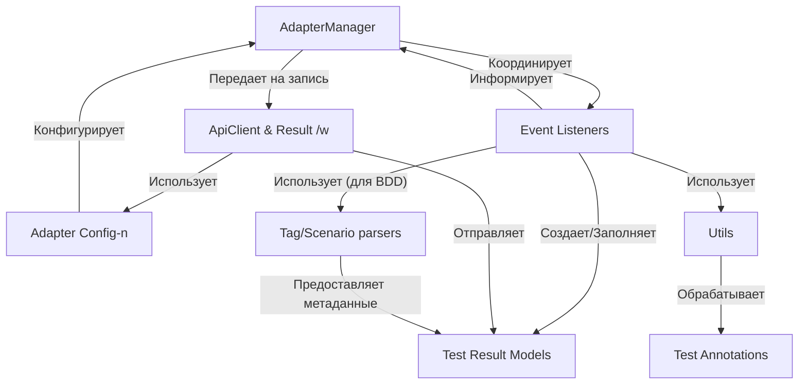

# Tutorial: adapters-java

Этот проект представляет собой набор **адаптеров** для различных Java-фреймворков тестирования (JUnit, TestNG, Cucumber, JBehave).
Его главная цель — *интегрировать* ваши автоматические тесты с системой управления тестированием **Test IT**.
Адаптеры автоматически собирают результаты выполнения тестов (статус, шаги, ошибки, вложения) и отправляют их в Test IT, создавая или обновляя *тест-раны* и связывая автотесты с тест-кейсами. Это упрощает анализ результатов и отчетность.

**Source Repository:** [https://github.com/testit-tms/adapters-java](https://github.com/testit-tms/adapters-java)

## Chapters

1. [Конфигурация Адаптера
](01_конфигурация_адаптера_.md)
2. [Аннотации для Тестов
](02_аннотации_для_тестов_.md)
3. [Модели Результатов Тестирования
](03_модели_результатов_тестирования_.md)
4. [Слушатели событий фреймворков
](04_слушатели_событий_фреймворков_.md)
5. [Парсеры Сценариев/Тегов (Cucumber/JBehave)
](05_парсеры_сценариев_тегов__cucumber_jbehave__.md)
6. [Менеджер Адаптера
](06_менеджер_адаптера_.md)
7. [Клиент API и Запись Результатов
](07_клиент_api.md)
8. [Утилиты
](08_утилиты_.md)

---

Generated by [AI Codebase Knowledge Builder](https://github.com/The-Pocket/Tutorial-Codebase-Knowledge)
