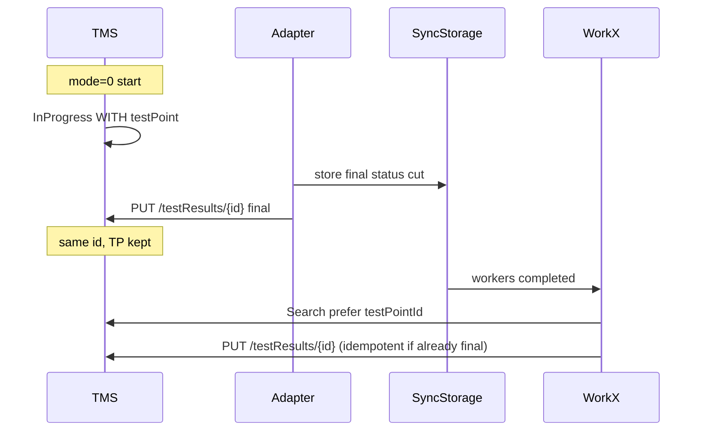

# Mode 0: orphan InProgress without testPoint — problem and cross-adapter fix

**TMS:** 5.7  
**Seen with:** Java adapter 3.1.0/3.1.1-TMS-5.7 + sync-storage `v0.3.7-tms-5.7` (fix in sources → `v0.3.8-*`)  
**Also reproduced:** Python adapter (same symptom pattern)  
**Scope:** all adapters that use sync-storage + `adapterMode=0` (run from test plan)  
**sync-storage change log:** [`sync_storage/adapters-core/docs/WORK_X_PUT_MODE0_ORPHAN.md`](../sync_storage/adapters-core/docs/WORK_X_PUT_MODE0_ORPHAN.md)

---

## 1. Problem

### Symptoms (client)

1. Launch **one** autotest from a test plan (UI → CI, `adapterMode=0`, valid `testRunId`).
2. CI: `BUILD SUCCESS`, `Tests run: 1`.
3. `GET /api/v2/testRuns/{id}/testPoints/results` shows **two** rows for the same `externalId`:
   - one with a real `testPointId` (plan point), status **InProgress**;
   - one with `testPointId: null` (orphan), status **InProgress** (or final Passed/Failed only on the orphan).
4. UI: two lines; test run does not close; point stays InProgress.

### Timeline (typical)

| When | What |
|------|------|
| T0 | TMS creates InProgress **with** `testPointId` when the run starts from the plan |
| T1 | Adapter / sync-storage runs the test |
| T2 | Adapter calls `POST .../testRuns/{id}/testResults` (`setAutoTestResultsForTestRun`) **without** `testPointId` → **orphan** result |
| T3 | Final status either never written, or written again via create → orphan Passed/Failed; TP result stays InProgress |

### Root cause (short)

| Layer | Mistake |
|-------|---------|
| Adapter | After sync-storage accepts the cut, sends a **new** InProgress (or final) via **create** API instead of **updating** the existing TP-bound result |
| sync-storage Work X | Finalizes via `SetAutoTestResultsForTestRun` (create, no `testPointId`) instead of `PUT /api/v2/testResults/{id}` |
| Search in Work X | Hard `startedOn` filter from adapter start time drops TP results created earlier / with `startedOn: null`; fallback to `searchResponse[0]` can close the wrong test |

**Not the root cause:** wrong Jenkins webhook / `testRunId`, Surefire `forkCount`, or “TMS invents orphans by itself”.  
Create without `testPointId` is expected TMS behavior; adapters must not call create when a TP-bound InProgress already exists.

### Success vs failure (API semantics)

- **Success path:** same result `id` is **updated** (PUT) → `outcome` becomes Passed/Failed, `testPointId` preserved, run completes.
- **Failure path:** **insert** a new result without `testPointId` → orphan group + stuck TP InProgress.

---

## 2. Correct contract (all adapters)

```text
adapterMode=0 + test run from plan
  → TMS already created InProgress WITH testPointId

On test finish:
  1. POST cut to sync-storage /in_progress_test_result (final status in cut)  [optional if sync used]
  2. Find existing InProgress for (testRunId, configurationId, externalId)
       prefer result with valid testPointId (not null / not 00000000-...)
  3. PUT /api/v2/testResults/{id} with final status
  4. NEVER call setAutoTestResultsForTestRun for that autotest if a TP-bound InProgress exists

Work X (sync-storage), when workers completed:
  1. Search InProgress in test run (no hard startedOn filter)
  2. Match autotestExternalId (mandatory; no blind [0] fallback)
  3. Prefer testPointId
  4. PUT /api/v2/testResults/{id}
  5. setAutoTestResultsForTestRun only as fallback if nothing to update
```



---

## 3. Changes made (Java + sync-storage sources)

### 3.1 Java — `testit-java-commons`

| File | Change |
|------|--------|
| `AdapterTestCaseHelper.stopTestCase` | After sync success: keep **final** `ItemStatus`; call `writeTestRealtime` with final status; **do not** force `INPROGRESS` + create |
| `HttpWriter.writeTestRealtime` | Before `sendTestResults` (create): `findInProgressTestResultId` → if found, **PUT** update |
| `ITmsApiClient` / `TmsApiClient` | New `findInProgressTestResultId(externalId)` — search InProgress, prefer valid `testPointId` |
| Tests | `AdapterTestCaseHelperStopTest` — sync path keeps Passed/Failed; no forced InProgress |

### 3.2 sync-storage (shared binary)

| File | Change |
|------|--------|
| `test_result_sender.SearchTestResult` | Drop hard `startedOn` filter; require `autotestExternalId` match; prefer `testPointId`; no `[0]` fallback |
| `core_service.OnAllNodesCompletedOrOffline` (Work X) | Primary path: `UpdateTestResult` (PUT); create API only on PUT failure |
| `TestResultShortResponse` | Field `testPointId` for prefer logic |
| `version.yml` | Track next release (`v0.3.8-*`) |

**Release note:** bump `SYNC_STORAGE_VERSION` in each adapter’s runner **only after** the binary is published. Until then, auto-download of `v0.3.7` will not include Work X fixes; Java-side PUT still reduces orphan create.

---

## 4. Guide: implement / maintain in other adapters

Apply the same rules in Python, .NET, JS, Robot, etc. Sync-storage Work X is shared — fix once in the binary; adapter-side create→update must be done **per language**.

### 4.1 Checklist (adapter)

- [ ] On test stop, if sync-storage accepted the cut: **do not** mutate local status to InProgress solely to POST a new TMS result.
- [ ] Export final status with: search existing InProgress → prefer `testPointId` → **PUT** `{id}`.
- [ ] Call `setAutoTestResultsForTestRun` / equivalent create **only** when no InProgress exists for that `externalId` (e.g. mode 1/2 without pre-created points).
- [ ] Payload for create must never be used as the primary path in `adapterMode=0`.
- [ ] Unit tests: mode=0 + sync success → create API **not** called when TP InProgress exists; PUT called with final status.
- [ ] After sync-storage `v0.3.8+` publish: bump pinned version in the adapter’s downloader.

### 4.2 Checklist (sync-storage — once for all)

- [ ] Work X uses PUT, not create, when an InProgress id was found.
- [ ] Search: no hard `startedOn` from adapter clock; mandatory `externalId`; prefer `testPointId`.
- [ ] Removing `startedOn` **without** removing `[0]` fallback is unsafe (can finalize the wrong test in a large run).

### 4.3 API reference

| Intent | API |
|--------|-----|
| List InProgress in run | `POST /api/v2/testResults/search` — `testRunIds`, `configurationIds` (if available), `statusTypes: ["InProgress"]` |
| Read full result | `GET /api/v2/testResults/{id}` |
| Finalize / update | `PUT /api/v2/testResults/{id}` (`statusCode` / status fields per TMS 5.7) |
| Avoid for mode=0 when TP exists | `POST /api/v2/testRuns/{id}/testResults` (`setAutoTestResultsForTestRun`) |
| Sync cut (local) | `POST http://127.0.0.1:{port}/in_progress_test_result?testRunId=...` |

Valid `testPointId`: non-empty and not `00000000-0000-0000-0000-000000000000`.

### 4.4 Suggested selection algorithm (pseudo)

```text
function findInProgressToUpdate(testRunId, configurationId, externalId):
  items = search(testRunId, configurationId, statusTypes=[InProgress])
  matches = [r for r in items if r.autotestExternalId == externalId]
  if matches is empty:
    return null
  withTp = [r for r in matches if validTestPointId(r)]
  if withTp is not empty:
    return withTp[0].id   // or earliest createdDate
  // optional: GET each match if short DTO omits testPointId
  return matches[0].id    // orphan only if no TP-bound row
```

### 4.5 Regression scenarios to keep green

| # | Scenario | Expect |
|---|----------|--------|
| 1 | mode=0, 1 test from plan, sync on | One result; same id; Passed/Failed; `testPointId` set; run closable |
| 2 | mode=0, sync fails | Fallback still PUT if InProgress exists; no second InProgress |
| 3 | mode=2 / no pre-created results | Create still allowed when search returns empty |
| 4 | Large run, many InProgress | Finalize only matching `externalId`, never random first hit |
| 5 | Duplicate InProgress (TP + orphan) after old bug | Prefer TP id for PUT |

### 4.6 What not to “fix” in product config

- Switching client to `adapterMode=1` is a workaround, not a fix.
- Disabling sync-storage hides Work X issues but does not fix create-without-TP if the adapter still creates on stop.
- `importRealtime=true/false` alone does not fix orphan create if the write path still uses create.

---

## 5. Ownership

| Component | Owner |
|-----------|--------|
| Adapter stop/export path (create vs PUT) | Each adapter team (Java / Python / .NET / …) |
| sync-storage Work X + search | Shared sync-storage release |
| TMS create-without-TP semantics | Expected platform behavior — do not treat as TMS bug |

---

## 6. Related artifacts (this repo)

- Client repro (Java): `examples/testPointNull/`
- Client repro (Python pattern): `examples/testpointNull2/`
- Java helper: `testit-java-commons/.../AdapterTestCaseHelper.java`
- Java writer: `testit-java-commons/.../HttpWriter.java`
- Work X: `sync_storage/adapters-core/src/core/core_service/core_service.go`
- Search: `sync_storage/adapters-core/src/core/test_result_sender/test_result_sender.go`
